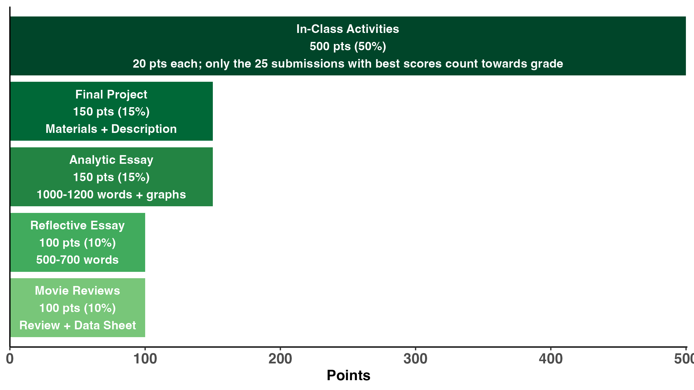

# Assignments, Attendance, and Grades


<!-- # Assignments, Grades, & Attendance {.unnumbered} -->

Learning in our class is achieved with an diverse array of methods ranging from data analysis to essays to projects. In most class sessions you will also be working with small groups of students to complete an in-class assignment that reinforces the major themes of the day's topic. In keeping with the philosophy of the Quest program, this course also has *Experiential Learning and Self-Reflection Components*. 

::: {.callout-tip}
## Important note regarding class discussions & group work.

We will explore some challenging, important problems and increase our understandings of different perspectives and approaches for addressing them. These conversations may not always be easy; we sometimes will make mistakes in both how we communicate our perspective and what we hear other say. There may be times when we need patience, courage, imagination, and of course mutual respect to engage our texts, classmates, instructors, guests, and our own ideas and experiences. *Disrespectful or disruptive behavior will not be tolerated*. And always remember that as scholars we rely on critical thinking, data, prior scholarship, and expert opinion when interrogating assigned readings and discussing course content with classmates and instructors.
:::

## Assignments (1000 pts total) {.unnumbered}  


<!-- ```{r graph2, echo=FALSE,message = FALSE,warning=FALSE, out.width = '100%',fig.align="center" } -->

<!--  -->
<!-- ``` -->

```{r assignments,echo = FALSE ,message = FALSE,warning = FALSE}

library(kableExtra)
library(gt)
library(tidyverse)
assignments <- data.frame(
    Assignment = c("In-class activities","Analytic Essay","Reflective Essay","Movie Reviews"), 
    Points = c(550,200,150,100),
    stringsAsFactors = FALSE
) %>% 
  mutate(`Percent`=Points/sum(Points)*100) %>% 
  mutate(`Percent`=paste0(`Percent`,"%"))


assignments |>
gt() |>
  tab_header(
    title = "Assignments for WIS 2323 and their point value.",
    # subtitle = "===")
  ) |>
  cols_width(
    Assignment ~ px(100),
    Points ~ px(30),
    Percent ~ px(30)
  )|>
  tab_style(
    style = cell_text(weight = "bold"),
    locations = cells_column_labels(columns = everything())
  ) |>
  cols_align(
  align = c("center"),
  columns = c("Points","Percent")
)

```


## Grading {.unnumbered} 

**In-class Assignments are due by the following class session.** Late assignments will lose 10 pts.

***Regrades:*** Requests for re-evaluation of assignments must be accompanied by an explanation for why you think you deserve additional credit and the number of additional points you think you deserve. The deadline for submission is one week after the work was returned.

***Grade Assignment*** (based on % of total points earned): A = 94--100%, A- = 90--93%, B+ = 87--89%, B = 84--86%, B- = 80--83%, C+ = 77--79%, C = 74--76%, C- = 70--73%, D+ = 67--69%, D = 64--66%, D- = 60--63%, E\<60

***Grade Points:*** For information on how UF assigns grade points, visit: <https://catalog.ufl.edu/UGRD/academic-regulations/grades-grading-policies/>

## Attendance {.unnumbered} 

Though attendance is not required, many of the sessions we will be completing activities in class that count towards your grade. Some these can be completed independently, but by doing them in class you will benefit from working collaboratively with the other students. **Not all in-class activities can be completed independently.** That is why only a subset of the in-class assignments count towards your grade. We also offer some opportunities for extra credit. **_If you need to miss class for any reason, please let me know as soon as possible_**. We will try to make arrangements for you to complete any assignments and go over any material you will be missing.

## Participation {.unnumbered} 

Consistent informed, thoughtful, and considerate class participation is encouraged (and in some cases required). *If you have personal issues that prohibit you from joining freely in class discussion (e.g., shyness, language barriers, medical condition): no problem.* let us know and we will discuss alternative modes of participation.


