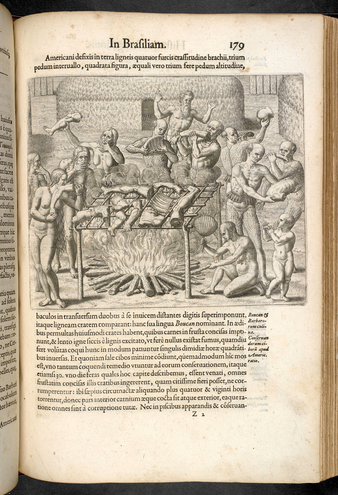

<!-- UPDATES TO MAKE: Add links to the public repositories of these texts on google books, etc. so people can find the original texts and images -->


```{r setup, include=FALSE}
knitr::opts_chunk$set(echo = TRUE)
```

<!-- # The Broader Context -->

<!-- \vspace{0.3cm} -->

<!-- ### The King James Bible (Revelations 21:1 & 22:1-2) -->

<!-- > And I saw a new heaven and a new earth: for the first heaven and the -->
<!-- > first earth were passed away; and there was no more sea. -->

<!-- > And he shewed me a pure river of water of life, clear as crystal, -->
<!-- > proceeding out of the throne of God and of the Lamb.In the midst of -->
<!-- > the street of it, and on either side of the river, was there the tree -->
<!-- > of life, which bare twelve manner of fruits, and yielded her fruit -->
<!-- > every month: and the leaves of the tree were for the healing of the -->
<!-- > nations. -->

# Historical Narratives & Travelogues (Text & Images)

\vspace{0.3cm}

--- 

### TEXT 1: Passage from *The Travels of Marco Polo* by Rustichello da Pisa (c. 1300)  
\vspace{0.2cm}  
_Marco Polo (September 15, 1254 -- January 8, 1324) was a Venetian merchant who
traveled through Asia between 1271 and 1295. The published account of his 
travels gave Europeans their first look into China, Japan, and 
other parts of Asia._  

> CHAPTER IX. CONCERNING THE ISLAND OF JAVA THE LESS. THE KINGDOMS OF 
FERLEC AND BASMA: 

<!-- > When you leave the Island of Pentam and sail about -->
<!-- > 100 miles, you reach the Island of JAVA THE LESS. For all its name -->
<!-- > 'tis none so small but that it has a compass of two thousand miles or -->
<!-- > more. Now I will tell you all about this Island. -->

<!-- > You see there are upon it eight kingdoms and eight crowned kings. The -->
<!-- > people are all Idolaters, and every kingdom has a language of its own. -->
<!-- > The Island hath great abundance of treasure, with costly spices, -->
<!-- > lign-aloes and spikenard and many others that never come into our -->
<!-- > parts. -->

<!-- > Now I am going to tell you all about these eight kingdoms, or at 
least the greater part of them. But let me premise one marvellous thing, 
and that is the fact that this Island lies so far to the south that 
the North Star, little or much, is never to be seen! -->

> Now let us resume our subject, and first I will tell you of the
kingdom of FERLEC. This kingdom, you must know, is so much frequented
by the Saracen merchants that they have converted the natives to the
Law of Mahommet---I mean the townspeople only, for the hill-people
live for all the world like beasts, and eat human flesh, as well as
all other kinds of flesh, clean or unclean. And they worship this,
that, and the other thing; for in fact the first thing that they see
on rising in the morning, that they do worship for the rest of the
day.

> Having told you of the kingdom of Ferlec, I will now tell of another
which is called BASMA. When you quit the kingdom of Ferlec you enter
upon that of Basma. This also is an independent kingdom, and the
people have a language of their own; but they are just like beasts
without laws or religion. They call themselves subjects of the Great
Kaan, but they pay him no tribute; indeed they are so far away that
his men could not go thither. Still all these Islanders declare
themselves to be his subjects, and sometimes they send him curiosities
as presents. There are wild elephants in the country, and numerous
unicorns, which are very nearly as big. They have hair like that of a
buffalo, feet like those of an elephant, and a horn in the middle of
the forehead, which is black and very thick. They do no mischief,
however, with the horn, but with the tongue alone; for this is covered
all over with long and strong prickles [and when savage with any one
they crush him under their knees and then rasp him with their tongue].
The head resembles that of a wild boar, and they carry it ever bent
towards the ground. They delight much to abide in mire and mud. 'Tis a
passing ugly beast to look upon, and is not in the least like that
which our stories tell of as being caught in the lap of a virgin; in
fact, 'tis altogether different from what we fancied. 

<!-- > There are also
monkeys here in great numbers and of sundry kinds; and goshawks as 
black as crows. These are very large birds and capital for fowling. -->

<!-- > I may tell you moreover that when people bring home pygmies which they  
allege to come from India, 'tis all a lie and a cheat. For those little men,  
as they call them, are manufactured on this Island, and I will tell you how.  
You see there is on the Island a kind of monkey which is very small, and has  
a face just like a man's. They take these, and pluck out all the hair except  
the hair of the beard and on the breast, and then they dry them and stuff 
them and daub them with saffron and other things until they look like men. 
But you see it is all a cheat; for nowhere in India nor anywhere else  
in the world were there ever men seen so small as these pretended pygmies. -->

<!-- > Now I will say no more of the kingdom of Basma, but tell you of 
the others in succession. -->

> CHAPTER XII. CONCERNING THE ISLAND OF NECUVERAN: When you leave the
Island of Java (the less) and the kingdom of Lambri, you sail north
about 150 miles, and then you come to two Islands, one of which is
called NECUVERAN. In this Island they have no king nor chief, but live
like beasts. And I tell you they go all naked, both men and women, and
do not use the slightest covering of any kind. They are Idolaters.
Their woods are all of noble and valuable kinds of trees; such as Red
Sanders and Indian-nut and Cloves and Brazil and sundry other good
spices. There is nothing else worth relating; so we will go on, and I
will tell you of an Island called Angamanain.

> CHAPTER XIII. CONCERNING THE ISLAND OF ANGAMANAIN: Angamanain is a
very large Island. The people are without a king and are Idolaters,
and no better than wild beasts. And I assure you all the men of this
Island of Angamanain have heads like dogs, and teeth and eyes
likewise; in fact, in the face they are all just like big mastiff
dogs! They have a quantity of spices; but they are a most cruel
generation, and eat everybody that they can catch, if not of their own
race. They live on flesh and rice and milk, and have fruits different
from any of ours.

<!-- > CHAPTER LIII. OF THE GREAT DESCENT THAT LEADS TOWARDS THE 
KINGDOM OF MIEN * (present-day Myanmar)*. -->

<!-- > After leaving the Province of which I have been speaking you come to a 
great Descent. In fact you ride for two days and a half continually down hill. 
On all this descent there is nothing worthy of mention except only that there 
is a large place there where occasionally a great market is held; for all the 
people of the country round come thither on fixed days, three times a week, 
and hold a market there. They exchange gold for silver; for they have gold in 
abundance; and they give one weight of fine gold for five weights of fine 
silver; so this induces merchants to come from various quarters bringing silver 
which they exchange for gold with these people; and in this way the merchants 
make great gain. As regards those people of the country who dispose of gold 
so cheaply, you must understand that nobody is acquainted with their places 
of abode, for they dwell in inaccessible positions, in sites so wild and 
strong that no one can get at them to meddle with them. Nor will they allow 
anybody to accompany them so as to gain a knowledge of their abodes. -->

<!-- > After you have ridden those two days and a half down hill, you find 
yourself in a province towards the south which is pretty near to India, and 
this province is called AMIEN. You travel therein for fifteen days through a 
very unfrequented country, and through great woods abounding in elephants and 
unicorns and numbers of other wild beasts. There are no dwellings and no people,
so we need say no more of this wild country, for in sooth there is nothing to
tell. But I have a story to relate which you shall now hear. -->

<!-- > CHAPTER LXXVII. FURTHER PARTICULARS CONCERNING THE GREAT CITY OF
KINSAY: Those markets make a daily display of every kind of vegetables
and fruits; and among the latter there are in particular certain pears 
of enormous size, weighing as much as ten pounds apiece, and the pulp 
of which is white and fragrant like a confection; besides peaches in 
their season both yellow and white, of every delicate flavour. (EB: 
these "pears" are likely Chinese quinces, 
[*Pseudocydonia chinensis*](https://en.wikipedia.org/wiki/Pseudocydonia)) -->

<!-- CHAPTER LXXXII. OF THE CITY AND GREAT HAVEN OF ZAYTON: Now when you  
quit Fuju and cross the River, you travel for five days south-east  
through a fine country, meeting with a constant succession of  
flourishing cities, towns, and villages, rich in every product. You  
travel by mountains and valleys and plains, and in some places by  
great forests in which are many of the trees which give Camphor. There  
is plenty of game on the road, both of bird and beast. The people are  
all traders and craftsmen, subjects of the Great Kaan, and under the  
government of Fuju. When you have accomplished those five days'  
journey you arrive at the very great and noble city of ZAYTON, which  
is also subject to Fuju.  -->

<!-- > At this city you must know is the Haven of Zayton, frequented by all 
the ships of India, which bring thither spicery and all other kinds of costly 
wares. It is the port also that is frequented by all the merchants of Manzi, 
for hither is imported the most astonishing quantity of goods and of precious 
stones and pearls, and from this they are distributed all over Manzi.[NOTE 2] 
And I assure you that for one shipload of pepper that goes to Alexandria or 
elsewhere, destined for Christendom, there come a hundred such, aye and more 
too, to this haven of Zayton; for it is one of the two greatest havens 
in the world for commerce. -->

<!-- > The Great Kaan derives a very large revenue from the duties paid in 
this city and haven; for you must know that on all the merchandize imported, 
including precious stones and pearls, he levies a duty of ten per cent., or 
in other words takes tithe of everything. Then again the ship's charge for 
freight on small wares is 30%., on pepper 44 per cent., and on lignaloes, 
sandalwood, and other bulky goods 40%., so that between freight and the Kaan's 
duties the merchant has to pay a good half the value of his investment 
[though on the other half he makes such a profit that he is always glad to 
come back with a new supply of merchandize]. But you may well believe from 
what I have said that the Kaan hath a vast revenue from this city. -->

<!-- > There is a great abundance here of all provision for every necessity 
of man's life. It is a charming country, and the people are very 
quiet, and fond of an easy life. Many come hither from Upper India to 
have their bodies painted with the needle in the way we have elsewhere 
described, there being many adepts at this craft in the city. -->

--- 

### TEXT 2: Passage from Walter Raleigh's [*"The discovery of the large, rich, and beautiful Empire of Guiana, with a relation of the great and golden city of Manoa (which the Spaniards call El Dorado)"*; written c. 1620.](https://www.gutenberg.org/files/2272/2272-h/2272-h.htm). 
\vspace{0.2cm}
_Sir Walter Raleigh (c. 1552–1618) was one of the most important 
figures of the Elizabethan era and played a key role in English 
colonization of North America._

> The fourth river to the west of Caroli is Casnero: which falleth into
the Orenoque on this side of Amapaia. And that river is greater than
Danubius, or any of Europe: it riseth on the south of Guiana from the
mountains which divide Guiana from Amazons, and I think it to be
navigable many hundred miles. But we had no time, means, nor season of
the year, to search those rivers, for the causes aforesaid, the winter
being come upon us; although the winter and summer as touching cold
and heat differ not, neither do the trees ever sensibly lose their
leaves, but have always fruit either ripe or green, and most of them
both blossoms, leaves, ripe fruit, and green, at one time...

<!-- > : but their winter only consisteth of terrible rains, and overflowing of the 
rivers, with many great storms and gusts, thunder and lightnings, of 
which we had our fill ere we returned... -->

> There is no country which yieldeth more pleasure to the inhabitants, 
either for those common delights of hunting, hawking, fishing, fowling, 
and the rest, than Guiana doth; it hath so many plains, clear rivers, and 
abundance of pheasants, partridges, quails, rails, cranes, herons, and all other
fowl; deer of all sorts, porks, hares, lions, tigers, leopards, and
divers other sorts of beasts, either for chase or food. It hath a kind
of beast called cama or anta (tapir), as big as an English beef, and
in great plenty. To speak of the several sorts of every kind I fear
would be troublesome to the reader, and therefore I will omit them,
and conclude that both for health, good air, pleasure, and riches, I
am resolved it cannot be equalled by any region either in the east or
west. Moreover the country is so healthful, as of an hundred persons
and more, which lay without shift most sluttishly, and were every day
almost melted with heat in rowing and marching, and suddenly wet again
with great showers, and did eat of all sorts of corrupt fruits, and
made meals of fresh fish without seasoning, of tortugas, of lagartos
or crocodiles, and of all sorts good and bad, without either order or
measure, and besides lodged in the open air every night, we lost not
any one, nor had one ill-disposed to my knowledge; nor found any
calentura or other of those pestilent diseases which dwell in all hot
regions, and so near the equinoctial line.

--- 

### TEXT 3: Passage from: [*CAPTAIN COOK'S JOURNAL DURING HIS FIRST VOYAGE ROUND THE WORLD MADE IN H.M. BARK "ENDEAVOUR" (1768-71): A Literal Transcription of the Original MSS. with notes and introduction edited by Capt. W.J.L. Wharton, R.N., F.R.S. Hydrographer of the Admiralty.*](https://www.gutenberg.org/files/8106/8106-h/8106-h.htm).

\vspace{0.2cm}

_Captain James Cook (1728–1779) was a British explorer, navigator, 
cartographer, and a captain in the British Navy. Between 1768 and 1779 he 
made three voyages to the Pacific; he was the first European to visit Hawai'i, 
the eastern coast of Australia, and New Zealand._

> From what I have said of the Natives of New Holland^1^ they may appear to
some to be the most wretched People upon Earth; but in reality they
are far more happier than we Europeans, being wholy unacquainted not
only with the Superfluous, but with the necessary Conveniences so much
sought after in Europe; they are happy in not knowing the use of them.
They live in a Tranquility which is not disturbed by the Inequality of
Condition. The earth and Sea of their own accord furnishes them with
all things necessary for Life. They covet not Magnificient Houses,
Household-stuff, etc.; they live in a Warm and fine Climate, and enjoy
every wholesome Air, so that they have very little need of Cloathing;
and this they seem to be fully sencible of, for many to whom we gave
Cloth, etc., left it carelessly upon the Sea beach and in the Woods,
as a thing they had no manner of use for; in short, they seem'd to set
no Value upon anything we gave them, nor would they ever part with
anything of their own for any one Article we could offer them. This,
in my opinion, Argues that they think themselves provided with all the
necessarys of Life, and that they have no Superfluities.

> (The native Australians may be happy in their condition, but they
are without doubt among the lowest of mankind. Confirmed cannibals,
they lose no opportunity of gratifying their love of human flesh.
Mothers will kill and eat their own children, and the women again are
often mercilessly illtreated by their lords and masters. There are no
chiefs, and the land is divided into sections, occupied by families,
who consider everything in their district as their own. Internecine
war exists between the different tribes, which are very small. Their
treachery, which is unsurpassed, is simply an outcome of their savage
ideas, and in their eyes is a form of independence which resents any
intrusion on THEIR land, THEIR wild animals, and THEIR rights
generally. In their untutored state they therefore consider that any
method of getting rid of the invader is proper. Both sexes, as Cook
observed, are absolutely nude, and lead a wandering life, with no
fixed abode, subsisting on roots, fruits, and such living things as
they can catch. Nevertheless, although treated by the coarser order of
colonists as wild beasts to be extirpated, those who have studied them
have formed favourable opinions of their intelligence. The more savage
side of their disposition being, however, so very apparent, it is not
astonishing that, brought into contact with white settlers, who
equally consider that they have a right to settle, the aborigines are
rapidly disappearing.)


> ^1^_New Holland was the name given to what is today known as Australia_

--- 

### TEXT 4: Passage from Henry Morton Stanley's [*Through the Dark Continent Or The Sources of the Nile Around the Great Lakes of Equatorial Africa and Down the Livingstone River to the Atlantic Ocean.*, published 1879.]((https://www.google.com/books/edition/Through_the_Dark_Continent_Or_The_Source/UMHjwSzNAJsC?hl=en&gbpv=1))
\vspace{0.2cm}

_Stanley was a Welsh-American explorer and journalist famous for exploring 
Central Africa and his search for the missionary explorer David Livingstone 
("Dr. Livingstone, I presume?")._

> One hears much about 5 the silence of the forest" -- but the tropical
forest is not silent to the keen observer. The hum and murmur of
hundreds of busy insect tribes make populous the twilight shadows that
reign under the primeval growth. I hear the grinding of millions of
mandibles, the furious hiss of a tribe just alarmed or about to rush
to battle, millions of tiny wings rustling through the nether air, the
march of an insect tribe under the leaves, the startling leap of an
awakened mantis, the chirp of some eager and garrulous cricket, the
buzz of an ant-lion , the roar of a bull-frog . Add to these the
crackle of twigs, the fall of leaves, the dropping of nut and berry,
the occasional crash of a branch, or the constant creaking and swaying
of the forest tops as the strong wind brushes them or the gentle
breezes awake them to whispers. Though one were blind and alone in the
midst of a real tropical forest, one's sense of hearing would be
painfully alive to the fact that an incredible number of minute
industries, whose number one could never hope to estimate, were active
in the shades. Silence is impossible in a tropical forest.  

> ...

<!-- > About ten o'clock, as we cowered in most miserable condition under the 
rude, leafy shelters we had hastily thrown up, the people of the 
wooded bluffs of Iryamba, opposite the Lowwa confluence, came over to 
see what strange beings were those who had preferred the secrecy of 
the uninhabited grove to their own loud roystering society. Stock 
still we sat cowering in our leafy coverts, but the mild reproachful 
voice of Katembo, our cannibal interpreter, was heard labouring in the 
interests of peace, brotherhood, and goodwill. The rain pattered so 
incessantly that I could from my position only faintly hear Katembo's 
voice pleading, earnestly yet mildly, with his unsophisticated 
brothers of Iryamba, but I felt convinced from the angelic tones that 
they would act as a sedative on any living creature except a 
rhinoceros or a crocodile. The long-diawn bleating sound of the word " 
Sen-nen-neh," which I heard frequently uttered by Katembo, I studied 
until I became quite as proficient in it as he himself. 

Some other pleasures we have are in watching a sunny bank, where we 
may rest assured the crocodile lies dreaming of fish banquets, and 
whence he will rise and plunge with a startling splash; or in 
watching the tricks of some suspicious and watchful behemoth, whose 
roar has its volume redoubled as it is reverberated from shore to 
shore in these eerie wilds. -->

> Our terrors are numerous. First, the rocks and rapids, the plunging
cataract and whirling pool, which fortunately are passed, and which we
pray we shall not have to encounter again. Then the sudden storm,
which now blows each day up river, and, first wrinkling the face of
the river, soon raises heavy brown waves, like those of a lake, which,
having already suffered from, we are careful to avoid but the greatest
danger, an ever-recurring one, is that which we have to encounter each
time the wild howling cannibal aborigines observe us. Indeed, the
sense of security is short - lived, our pleasure evanescent; but the
sense of danger is always present, and pervades ouir minds whether in
our sleeping or our waking hours.

<!-- {height=40%}  -->

<!-- {height=50%}  -->

<!-- {height=50%} 
{height=50%}  -->

<!-- {height=50%}   -->

<!-- ### [John Augustine Zahm](https://en.wikipedia.org/wiki/John_Augustine_Zahm)
[*Following the Conquistadores: Up the Orinoco and Down the Magdalena*]
(https://www.google.com/books/edition/Following_the_Conquistadores_Up_the_Orin/J1wzAQAAIAAJ?hl=en&gbpv=1) (1910) -->

<!-- <!-- {height=50%} --> 

<!-- > CHAPTER IV - IN MID-ORINOQUIA -->

<!-- > At last we were ready to start on our long journey up the Orinoco and 
the Meta, and then across the llanos of Eastern Colombia, and the 
Cordilleras to far-off Bogotá. For several days the swarthy stevedores 
of Ciudad Bolivar had been busy in transferring to our little steamer 
the freight that had here been accumulating for her during the 
preceding six months. For several days, too, our friends and 
acquaintances had been endeavoring to dissuade us from what one and 
all pronounced a rash and dangerous undertaking. All meant well, but 
all were prophets of ill . No one, we were assured, had ever gone to 
Bogotá by the route we purposed taking, and we were solemnly warned 
time and again that we were surely risking our health if not exposing 
our lives. Every thing, it was averred, was against the successful 
termina tion of our journey, and it would be a miracle if we ever 
reached Bogotá alive. First of all, there were the steaming, miasmatic 
exhala tions in the Orinoco and Meta valleys, from which they were 
never free, and the ever present danger of yellow fever and other 
malignant diseases. Even people who were thoroughly acclimated 
incurred the greatest risk in traveling through this pestiferous, 
germ- laden atmosphere. How much more then should we, who had so 
recently come from the chilly north, be exposed, if we still persisted 
in our foolhardy venture ? And then , if we fell sick, as we surely 
must, we should be in a trackless wilderness, among savages, and far 
away from medical aid of any kind. -->

<!-- > Then there was the torrid climate to take into account. By reason of 
the intense heat, it would be impossible to travel by day. We should 
then perforce be obliged to travel by night. And this implied new 
dangers --- dangers of straying from a poorly defined trail , or of 
all kinds, with which the forests and plains were always infested . 
There was the jaguar, always prowling about, seeking whom he might 
devour ; the labairi and boaquira, serpents whose envenomed fangs 
bring certain death to their victims, and the dread boa that was 
pictured as hang ing in untold numbers from the branches of the trees 
in the forests through which we should pass. 

A torrid climate, a reeky, malarial atmosphere, a region infested with 
venomous serpents --- all this was bad enough, but this was far from 
being the sum total of the pests and plagues we should encounter. 
There was that ever- present pest --- whose name is not legion , but 
billion - on which travelers in South America have exhausted their 
supply of adjectives in the vain at tempt adequately to express their 
sentiments. I refer to what the Spaniard has so aptly called the plaga 
--- the plague --- the cloud of mosquitoes of many species that 
constantly torment the traveler, and give him no rest night or day. 

We had read what various writers on the equinoctial regions had to say 
of the murderous onslaughts of the mosquito from the time of the early 
missionaries down to our own, and such reading was far from calculated 
to reassure one who was about to form a more intimate acquaintance of 
the plaga in question. In a work written on the Orinoco in 1822, Mr. 
J. H. Robertson, referring to this matter, declares that " the biting, 
blistering, and intolerable itching " which is produced by clouds of 
mosquitoes is "indeed enough to make a man mad. " He says that they 
made the passengers-blacks as well as others, that were on the boat 
with him, " almost roar with agony," and that in the morning the " 
whole body exhibited one mass of small blisters from millions of bites 
we had received during the night." 

In a more recent book, by another Englishman, it is stated that the 
Orinoco is the " paradise of mosquitoes, and the hell of travelers. 
There, insects of unusual size, and speckled in an ominous and snake- 
like manner, issued from the bush in millions and assailed every 
square inch of the exposed skin. Moreover, they stung through 
theboots, coat and waistcoat, and drew blood wherever they penetrated. 
" ... This was an article that had recently been published in an 
English magazine which had just reached Ciudad Bolivar. The article 
was entitled, Adventures on the Orinoco, and contained the following 
paragraph: " For many reasons the Orinoco is one of the most danger 
ous rivers in the world. Not only are there countless physical dangers 
in the shape of sunken rocks, wrecks and tree trunks, huge sand banks, 
ever-changing channels and bewildering currents, but also many living, 
though often hidden, perils in the form of man, beast or reptile. The 
higher one ascends, and the farther one penetrates beyond the Maipures 
rapids into the heart of the Alto Orinoco, the wilder the scene, and 
the more perilous the river. Sparsely populated as is the vast region 
above and immediately below the rapids, it is often the home of 
anarchy and misrule, and always a domain where the passions of men 
know not the restraints of law, and civilization is still a dream." To 
clinch his argument, our friend assured us that the Meta region --- 
whither we were bound---was far worse than that of the Upper Orinoco. 
The banks of the Meta were always infested by hordes of savage 
Guahibos, the terror of eastern Colombia. Hiding in the dense 
underbrush that skirts the river, the first indication of their 
presence would be a shower of well- directed, poisoned arrows against 
the daring intruder into their jealously guarded domains. 

Footnote; "In a region, "says Humboldt, "where travelling is so 
uncommon, people seem to feel a pleasure in exaggerating to strangers 
the difficulties arising from the climate, the wild animals and the 
Indians." Op. cit. , Vol. I, p. 361 . 117 

<!-- {height=50%}    --> 

<!-- {height=50%} --> 

<!-- {height=50%}  -->

<!-- {height=50%} --> 

--- 

\newpage

### IMAGE 1: Hans Burgkmair
\vspace{0.2cm}

_Hans Burgkmair the Elder (1473-1531) was a German painter. The Kingdom of 
Cochin was a late medieval coastal kingdom in Southern India. King Unni 
Goda Varma of Cochin welcomed Pedro Álvares Cabral on 24 December 1500 and 
negotiated a treaty of alliance with Portugal._

```{r Burgkmair, echo=FALSE, fig.cap="\\textit{Left Side of King Cochin} by Hans Burgkmair (from his \\textit{Set of Exotic Races}, 1508)", out.width = '100%', fig.align="center"}

```

<!-- {height=70%} -->

\newpage

### IMAGE 2: Theodore de Bry
\vspace{0.2cm}  
*Theodor de Bry (1528 – 1598) was an engraver, goldsmith, editor and 
publisher, famous for his depictions of early European expeditions to the 
Americas. Most of his [illustrations] were based on first-hand observations 
by explorers, even if De Bry himself, acting as a recorder of information, 
never visited the Americas.* 

<!-- {height=70%} -->

```{r deBry, echo=FALSE, fig.cap="Illustration from Theodor de Bry's \\textit{Collected travels in the east Indies and west Indies} (1594).", out.width = '60%', fig.align="center"}

```
<!-- > {width=70%} -->


<!-- \newpage -->
<!-- ### ITEM 3: General and Natural History of the Indies Gonzalo Fernández de Oviedo y Valdés (1526)   -->

<!-- \vspace{0.2cm}  -->

<!-- *Gonzalo Fernández de Oviedo y Valdés (1478 -- 1557) participated in the 
Spanish colonization of the West Indies, arriving in the first few years 
after Christopher Columbus.*   -->

<!-- > Wonderful are the works of God, and very different in genres the 
animated things in various provinces and parts of the world, thus in 
their species and forms, as in its greatness and proportion, and in 
its effects and particularities: and in such a way, that none of the 
land animals, or fish and animals of the water, you can not finish 
writing or knowing by human diligence, nor have the lives of the men 
who have occupied themselves in this, to say it all, nor will there be 
a lack of things to notice to all those who are alive or come after us" -->

<!-- <<THIS PASSAGE WAS TOUGH TO UNDERSTAND, SEE IF YOU CAN FIND A BETTER ONE>> -->
<!-- \newpage -->

<!-- More on de Bry [here](https://smarthistory.org/engravings-theodore-de-bry/) -->

<!-- \newpage -->
<!-- ### ITEM 4: Cristóbal de Acuña, [*A relation of the great river of 
Amazons in South-America. : Containing all the particulars of Father 
Christopher d'Acugna's voyage, made at the command of the king of Spain.*]
(https://www.loc.gov/resource/rbc0001.2019gen09583/?sp=77&clip=135,64,1441,2203&ciw=296&rot=0) (1597). -->
                                                                                                                    

<!-- *Cristóbal Diatristán de Acuña (1597-c. 1676) was a Spanish missionary and 
explorer. In 1639 he accompanied Pedro Teixeira in his second exploration of 
the Amazon, in order to take scientific observations, and draw up a report 
for the Spanish government. * -->

<!-- <!-- \ -->
<!-- {height=70%}!
[Acuna Text No 3](./texts_images/acuna/acuna2.png){height=70%} -->
<!-- {height=70%}!
[Acuna Text No 5](./texts_images/acuna/acuna4.png){height=70%} -->


<!-- ### ITEM 5: Walter Raleigh, [*History of the World*]
(https://www.google.com/books/edition/The_history_of_the_world/FwUMAQAAMAAJ?hl=en&gbpv=0) (1614) -->

<!-- > SECT. VIII: Of their opinion that seat paradise under the equinoctial: 
and of the pleasant habitation under those climates. -->

<!-- > Those which come nearer unto reason find paradise under the  
equinoctial line, as Tertullian, Bonaventure, and Durandus; judging,  
that thereunder might be found most pleasure, and the greatest  
fertility of soil: but against it "Thomas Aquinas objecteth the  
distemperate heat, which he supposeth to be in all places so directly  
under the sun; but this is non causa pro causa; for although paradise  
could not be under the line, because Eden is far from it, in which  
paradise was; and because there is no part of Euphrates, 'Tigris, or  
Ganges under it, (Ganges being one of the four rivers, as they  
suppose,) yet this conceit of distemper (being but an old opinion) is  
found to be very untrue, though for the conjecture not to be  
condemned, considering the age when those fathers wrote, grounded  
chiefly on this: that whereas it appeared, that every country, as it  
lay by degrees nearer the tropic, and so toward the equinoctial, did  
so much the more exceed in heat; it was therefore a reasonable  
conjecture, that those countries which were situated directly under  
it, were of a distemper uninhabitable: but it seemeth that Tertullian  
conceived better, and so did Avicenne, for they both thought them  
habitable enough: and though (perchance) in those days it might be  
thought a fantastical opinion, (as all are which go against the  
vulgar) yet we now find, that if there be any place upon the earth of  
that nature, beauty, and delight, that paradise had, the same must be  
found within that supposed uninhabitable burnt zone, or within the  
tropics, and nearest to the line itself. For hereof experience hath  
informed reason, and time hath made those things apparent which were  
hidden, and could not by any contemplation be discovered. Indeed it  
hath so pleased God to provide for all living creatures, wherewith he  
hath filled the world, that such inconveniences which we contemplate  
afar off, are found by trial and the witness of men's travels to be so  
qualified, as there is no portion of the earth made in vain, or as a  
fruitless lump to fashion out the rest. For °God himself; saith  
Isaiah, that formed the earth and made it; he that prepared it, he  
created it not in vain, he formed it to be inhabited. Now we find that  
these hottest regions of the world seated under the equinoctial line,  
or near it, are so refreshed with a daily gale of easterly wind,  
(which the Spaniards call the Brize,) that doth evermore blow  
strongest in the heat of the day, as the downright beams of the sun  
cannot so much master it, that there is any inconvenience or  
distemperate heat found thereby. -->

<!-- > Secondly, the nights are so cold, 
fresh, and equal, by reason of the entire interposition of the earth, 
as (for those places which myself have seen, near the line and under 
it) I know no other part of the world of better, or equal temper; only 
there are some tracts, which by accident of high mountains are barred 
from this air and fresh wind, and some few sandy parts without trees, 
which are not therefore so well inhabited as the rest ; and such 
difference of soils we find also in all other parts of the world. But 
(for the greatest part) those regions have so many goodly rivers, 
fountains, and little brooks, abundance of high cedars, and other 
stately trees casting shade, so many sorts of delicate fruits, ever 
bearing, and at all times beautified with blossom and fruit, both 
green and ripe, as it may of all other parts be best compared to the 
paradise of Eden: the boughs and branches are never unclothed and left 
naked; their sap creepeth not under ground into the root, fearing the 
injury of the frost; neither doth Pomona at any times despise her 
withered husband Vertumnus, in his winterquarters and old age. 
Therefore are these countries called terre vitiose, "vicious 
countries" for nature being liberal to all without labour, necessity 
imposing no industry or travel, idleness bringeth forth no other 
fruits than vain thoughts or lisencious pleasures.  -->

<!-- > So that to conclude this part, Tertullian and those of his opinion were 
not deceived in the nature of the place: but Aquinas, who misliked this opinion,
and followed a worse. And (to say the truth) all the schoolmen were gross 
in this particular. -->


<!-- <<THIS IS AS FAR AS WE GOT IN CLASS. EITHER FIND SHORTER ONES 
ABOVE OR DELETE THE ONES BELOW>> -->


<!-- {height=50%}   -->

<!-- {height=50%}   -->

<!-- {height=50%}   -->
<!-- \newpage -->


<!-- ### ITEM 6: Text and Images from Prince Maximilian zu Wied's *Travels to Brazil, 1820* -->
<!-- \vspace{0.2cm} -->
<!-- *Prince Alexander Philipp Maximilian zu Wied-Neuwied (1782–1867) was a
German explorer and naturalist. From 1815–1817 he led an expedition to the
southeast of Brazil.* -->

<!-- > *Puris in their Hut*: When our first curiousity was satisfied," writes
the Prince (p. 118), "we requested the savages to conduct us to their huts...
They are certainly some of the most simple in the world...small and so exposed
on every side, that when the weather is unfavourable the brown inmates are seen
seeking protection against it by crowding close round the fire...: at other
times the man lies stretched at his ease in his hammock, while the woman
attends the fire, and broils meat, which is stuck on a pointed stick. -->

<!-- > *Opening of the New Road along the Mucuri:* As the rivers afford the
means of the most speedy communication, it has been resolved to make these
roads along them.   -->

<!-- > *A Family of Botocudos on a Journey:* The sight of the Botocudos
astonished us beyond all expression; we had never before seen such strange and
singularly ugly beings. Their original countenances were farther disfigured by
large pieces of wood which they wore in their lower lips and in their ears: the
lip is thus made to project very much, and the ears of some of them hang like
large wings down to their shoulders. -->

<!-- {height=40%}   -->

<!-- {height=40%} -->

<!-- {height=40%}   -->

<!-- \newpage -->

