---

{fig-alt="alt text to be filled" fig-align="center" width=100%}

---

{fig-alt="alt text to be filled" fig-align="center" width=100%}

--- 

{fig-alt="alt text to be filled" fig-align="center" width=100%}

--- 

{fig-alt="alt text to be filled" fig-align="center" width=100%}

::: {.notes}
The Italian title of his book was Il Libro di Marco Polo soprannominato Milione, which means "The Book of Marco Polo, nicknamed 'Milione'"". According to the 15th-century humanist Giovanni Battista Ramusio, his fellow citizens awarded him this nickname when he came back to Venice because he kept on saying that Kublai Khan's wealth was counted in millions. More precisely, he was nicknamed Messer Marco Milioni (Mr Marco Millions).
:::

--- 

{fig-alt="alt text to be filled" fig-align="center" width=100%}

::: {.notes}
Though he was not the first European to reach China, Marco Polo was the first to leave a detailed chronicle of his experience. the first Western record of porcelain, gunpowder, paper money, and some Asian plants and exotic animals. His narrative inspired Christopher Columbus and many other travellers.

His travels are recorded in The Travels of Marco Polo (also known as Book of the Marvels of the World and Il Milione, c. 1300), a book that described to Europeans the then mysterious culture and inner workings of the Eastern world, including the wealth and great size of the Mongol Empire and China in the Yuan Dynasty, giving their first comprehensive look into China, Persia, India, Japan and other Asian cities and countries.[4]

https://en.wikipedia.org/wiki/Marco_Polo 
:::

--- 

{fig-alt="alt text to be filled" fig-align="center" width=100%}

::: {.notes}
and then something happened here...what do you notice? may remind you of this one down here...another strait, HORMUZ"
:::

--- 

{fig-alt="alt text to be filled" fig-align="center" width=100%}

::: {.notes}
conquest of Constantinople by Sultan Mehmed II of the Ottoman Empire. The dwindling Byzantine Empire came to an end when the Ottomans breached Constantinople’s ancient land wall after besieging the city for 55 days. Mehmed surrounded Constantinople from land and sea while employing cannon to maintain a constant barrage of the city’s formidable walls. The fall of the city removed what was once a powerful defense for Christian Europe against Muslim invasion, allowing for uninterrupted Ottoman expansion into eastern Europe. https://www.britannica.com/event/Fall-of-Constantinople-1453 

Many nations were looking for goods such as silver and gold, but one of the biggest reasons for exploration was the desire to find a new route for the spice and silk trades. When the Ottoman Empire took control of Constantinople in 1453, it blocked European access to the area, severely limiting trade. In addition, it also blocked access to North Africa and the Red Sea, two very important trade routes to the Far East.
The first of the journeys associated with the Age of Discovery were conducted by the Portuguese. Although the Portuguese, Spanish, Italians, and others had been plying the Mediterranean for generations, most sailors kept well within sight of land or traveled known routes between ports. Prince Henry the Navigator changed that, encouraging explorers to sail beyond the mapped routes and discover new trade routes to West Africa.
Portuguese explorers discovered the Madeira Islands in 1419 and the Azores in 1427. Over the coming decades, they would push farther south along the African coast, reaching the coast of present-day Senegal by the 1440s and the Cape of Good Hope by 1490. Less than a decade later, in 1498, Vasco da Gama would follow this route all the way to India.
https://www.thoughtco.com/age-of-exploration-1435006 

:::

--- 

{fig-alt="alt text to be filled" fig-align="center" width=100%}

::: {.notes}
reinforcing a previous one (Dum Diversas, 1452) 

:::

--- 

{fig-alt="alt text to be filled" fig-align="center" width=100%}

::: {.notes}
If you think the Portuguese were overdoing their investment in a naval fleet and maintaining colonial outposts around the world for a few spicy plants, just remember that cinnamon, ginger, and nutmeg are 3 of the 4 ingredients in…

:::

--- 

## PUMPKIN SPICE LATTE

{fig-alt="alt text to be filled" fig-align="center" width=100%}

_**Also now:** Pumpkin Cream Cold Brew, Iced Pumpkin Cream Chai, 
Pumpkin Spice Frappuccino, Iced Pumpkin Cream Shaken Espresso, 
Pumpkin Spice Chai, and Pumpkin Cream Matcha._

::: {.notes}
Sbucks sells ~20 million PSL per yr
424 million Pumpkin Spice Lattes since debut
analysts estimate drink generates >$500 million per yr

…the Pumpkin Spice that Starbucks turned into one of the most profitable and annoying products in their history. Sbucks sells ~20 million pumpkin spice lattes each year

BTW the 4th ingredient is all allspice: dried and ground berries of the _Pimenta dioica_ (Jamaica pepper, myrtle pepper) tree, now grown around the tropics but originally from carribean and central america. not a blend of spices, named ". Named "all spice" by the English because its flavor combines cinnamon, nutmeg, and nutmeg. Spaniards mistook it for a pepper, hence "Pimenta"

Read More: https://www.thetakeout.com/1946784/how-many-pumpkin-spice-lattes-starbucks-sells/
:::

---  

{fig-alt="alt text to be filled" fig-align="center" width=100%}

::: {.notes}
OUT. OF. CONTROL.
:::

--- 

{fig-alt="alt text to be filled" fig-align="center" width=100%}

::: {.notes}
1. Most Europeans entered the tropics in a political and social climate of colonization and exploitation (of people, their culture, and natural resources). 

2. That shapes their perceptions of both tropical environments and the people they encountered.

3. These people wrote home about what they saw, and brought things back with them.  

4. These stories percolate through society and are reflected back by authors and artists for consumption by the public.

5. This reinforces and helps perpetuate the first perceptions (and misconceptions).

Historians generally recognize three motives for European exploration and colonization in the New World: God, gold, and glory.

On October 12, 1492, Italian explorer Christopher Columbus made landfall in what is now the Bahamas. Columbus and his ships landed on an island that the native Lucayan people called Guanahani. Columbus renamed it San Salvador. https://education.nationalgeographic.org/resource/columbus-makes-landfall-caribbean

:::

--- 

{fig-alt="alt text to be filled" fig-align="center" width=100%}

::: {.notes}
On 4 May 1493, two months after Columbus's arrival, the Catholic Monarchs received a bull (Inter caetera) from Pope Alexander VI stating that all lands west and south of a pole-to-pole line 100 leagues west and south of the Azores or the Cape Verde Islands should belong to Castille and, later, all mainlands and islands then belonging to India. It did not mention Portugal, which could not claim newly discovered lands east of the line.
King John II of Portugal was not pleased with the arrangement, feeling that it gave him far too little land—preventing him from reaching India, his main goal. He then negotiated directly with King Ferdinand and Queen Isabella of Spain to move the line west, and allowing him to claim newly discovered lands east of it.[99]

An agreement was reached in 1494, with the Treaty of Tordesillas that divided the world between the two powers. In this treaty the Portuguese received everything outside Europe east of a line that ran 370 leagues west of the Cape Verde islands (already Portuguese), and the islands discovered by Christopher Columbus on his first voyage (claimed for Castile), named in the treaty as Cipangu and Antilia (Cuba and Hispaniola). This gave them control over Africa, Asia and eastern South America (Brazil). The Spanish (Castile) received everything west of this line. At the time of negotiation, the treaty split the known world of Atlantic islands roughly in half, with the dividing line about halfway between Portuguese Cape Verde and the Spanish discoveries in the Caribbean.

:::

--- 

{fig-alt="alt text to be filled" fig-align="center" width=100%}

::: {.notes}
SIR WALTER RALEIGH: The discovery of the large, rich, and beautiful Empire of Guiana, with a relation of the great and golden city of Manoa (which the Spaniards call El Dorado).[1] 

:::

--- 

{fig-alt="alt text to be filled" fig-align="center" width=100%}

::: {.notes}

:::

--- 

{fig-alt="alt text to be filled" fig-align="center" width=100%}

::: {.notes}

:::

--- 

{fig-alt="alt text to be filled" fig-align="center" width=100%}

::: {.notes}

:::

---

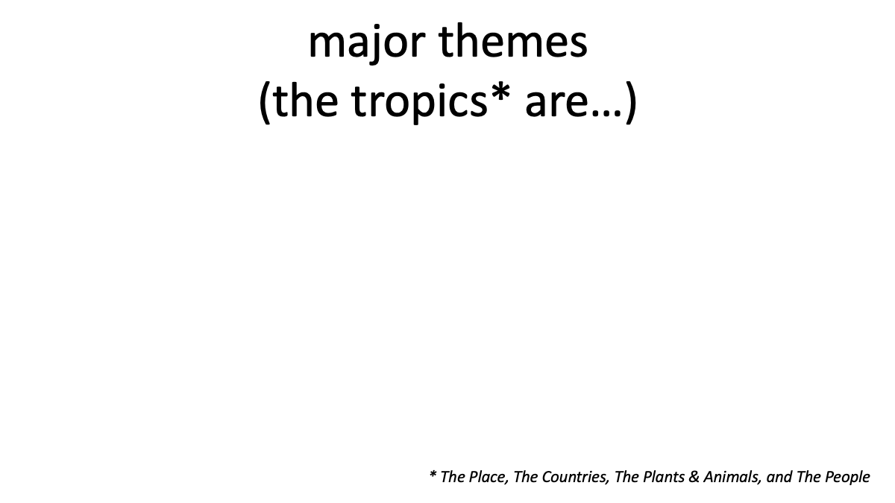{fig-alt="alt text to be filled" fig-align="center" width=100%}

::: {.notes}
Paradise
Exploitable
Hell
Conquerable
Mystical
Dangerous 
Transformative/A Crucible: A place of self-discovery, 
where - if you can overcome obstacles and survive - you emerge 
a better, stronger person
:::

--- 

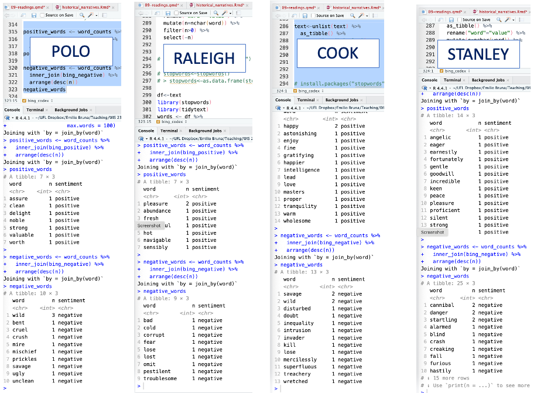{fig-alt="alt text to be filled" fig-align="center" width=100%}

::: {.notes}

lets just take a look at the first two...Marco Polo and Walter Raleigh.
:::

--- 

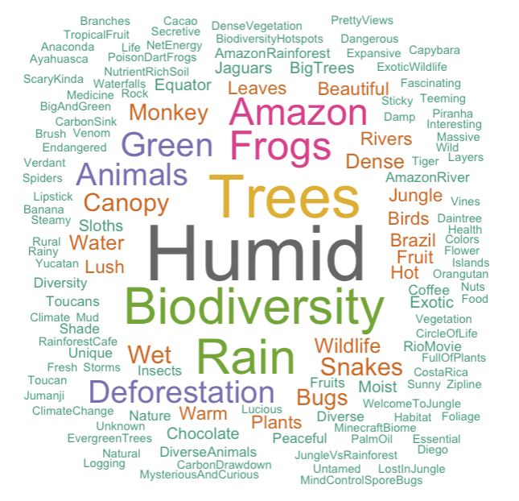{fig-alt="alt text to be filled" fig-align="center" width=100%}

::: {.notes}

:::

--- 

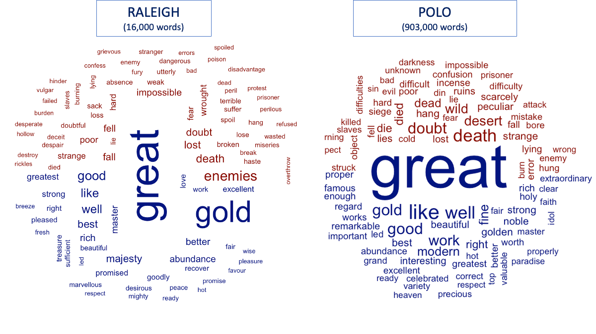{fig-alt="alt text to be filled" fig-align="center" width=100%}

::: {.notes}

:::

--- 

#### Willem Piso _Historia Naturalis Brasiliae_ (1648) 

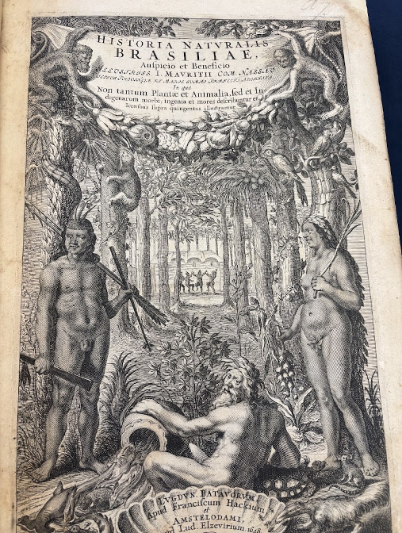{fig-alt="alt text to be filled" fig-align="center" height=500%} 

_summarizing research by Georg Marcgraf_

::: {.notes}
by Willem Piso (Dutch) summarizing research by Georg Marcgraf (German)

:::

---  

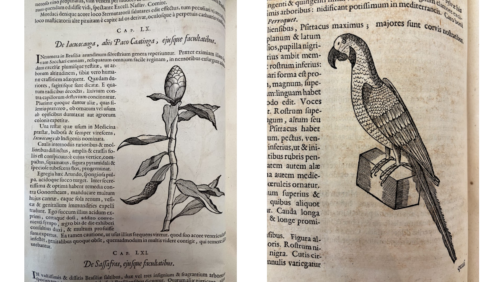{fig-alt="alt text to be filled" fig-align="center" width=100%}

::: {.notes}

:::

--- 

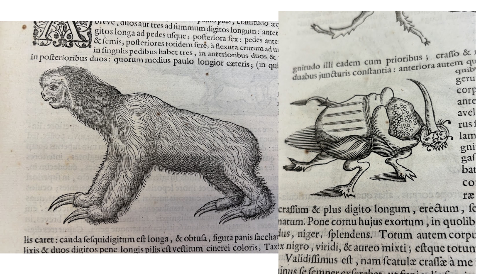{fig-alt="alt text to be filled" fig-align="center" width=100%}

::: {.notes}

:::

--- 

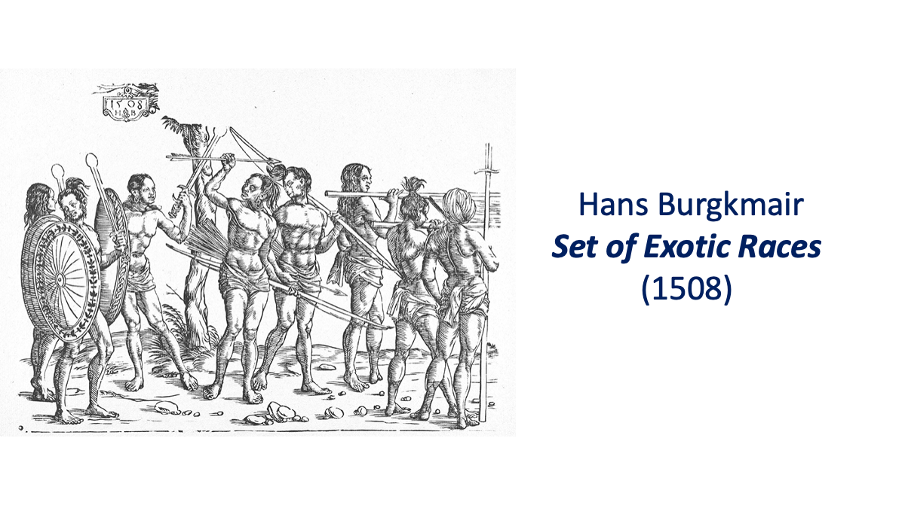{fig-alt="alt text to be filled" fig-align="center" width=100%}

_Cochin is the central part of present-day Kerala state, India._

::: {.notes}

https://www.jstor.org/stable/40645477?seq=11

From Hans Burgkmair's _Set of Exotic Races_ (1508): _Left Side of King Cochin_.

_Hans Burgkmair the Elder (1473-1531) was a German painter. The Kingdom of 
Cochin was a late medieval coastal kingdom in Southern India. King Unni 
Goda Varma of Cochin welcomed Pedro Álvares Cabral on 24 December 1500 and 
negotiated a treaty of alliance with Portugal._

:::

--- 

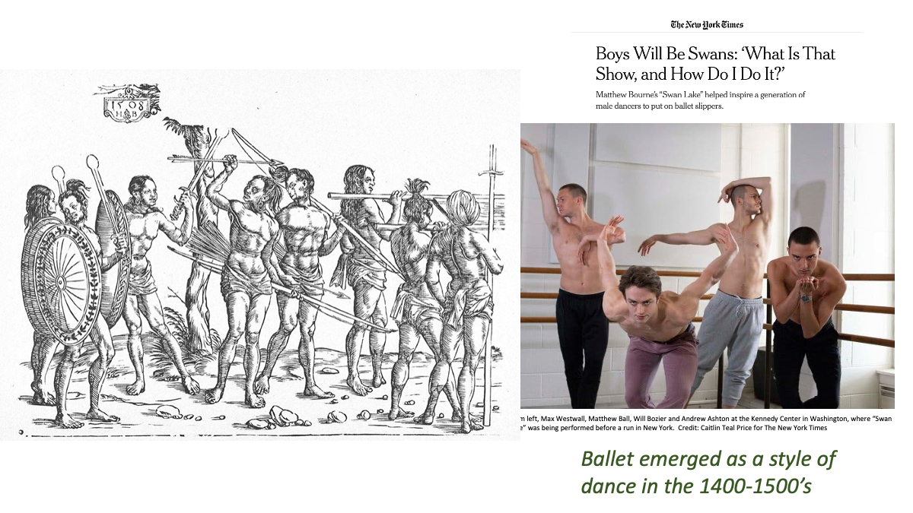{fig-alt="alt text to be filled" fig-align="center" width=100%}

::: {.notes}

:::

--- 

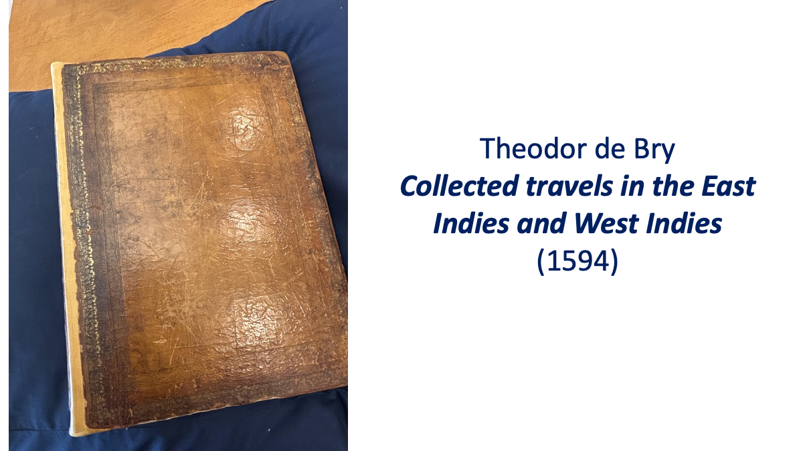{fig-alt="alt text to be filled" fig-align="center" width=100%}

::: {.notes}
Theodor de Bry's _Collected travels in the east Indies and west Indies_ (1594).

De Bry’s copperplate engravings were among the first images that Europeans encountered about the peoples, places, and things of the Americas,

Theodor de Bry (1528 – 1598) was an engraver, goldsmith, editor and 
publisher, famous for his depictions of early European expeditions to the 
Americas. Most of his [illustrations] were based on first-hand observations 
by explorers, even if De Bry himself, acting as a recorder of information, 
never visited the Americas.

:::

--- 

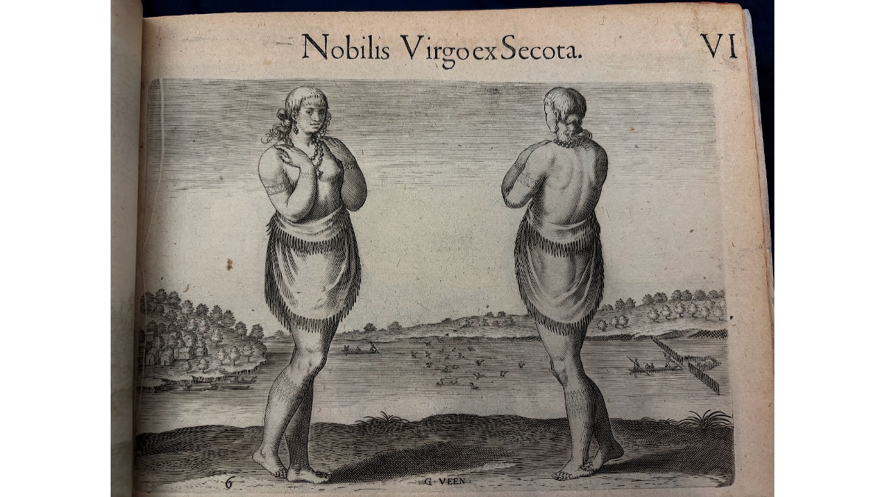{fig-alt="alt text to be filled" fig-align="center" width=100%}

::: {.notes}
"Nobel virgin of the south" Included drawings of Timucuans
Taínos resemble Greco-Roman sculptures, especially their poses and musculature. De Bry apparently had no interest in documenting the actual appearance of the Taínos.

:::

--- 

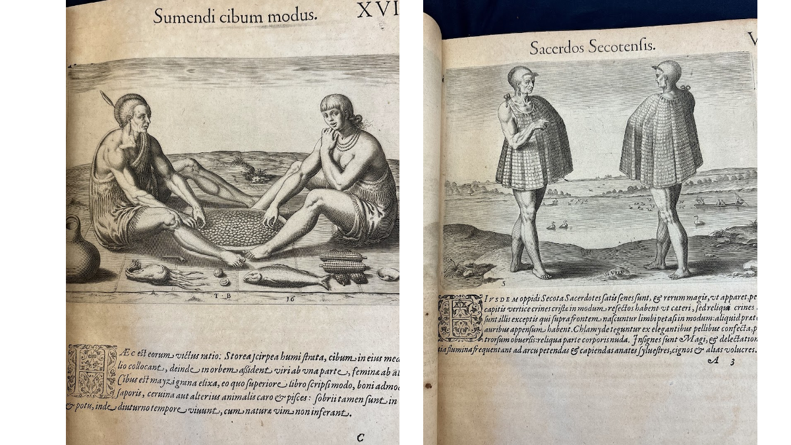{fig-alt="alt text to be filled" fig-align="center" width=100%}

::: {.notes}

"Manner of taking food"

:::

--- 

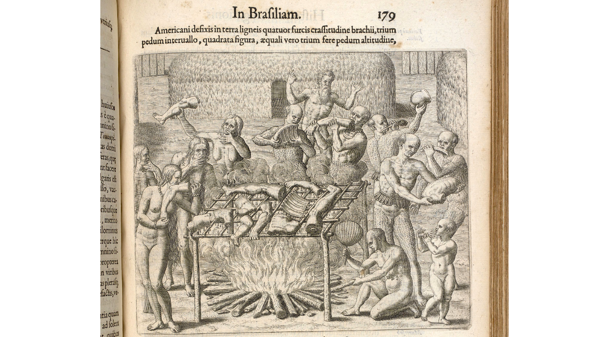{fig-alt="alt text to be filled" fig-align="center" width=100%}

::: {.notes}

his third volume recounted Hans Staden’s experiences of cannibalism in Brazil. There is near universal agreement that some Mesoamericans practiced human sacrifice and cannibalism, but extent is open question.

Staden, a German soldier who traveled to South America, had been captured in 1553 by the Tupinambá, an Indigenous group in Brazil. After his return to Europe in 1557, he wrote about Tupinambá customs, family life, and cannibalism, describing how the Tupinambá practiced it ceremonially, especially eating their enemies. 

:::

--- 

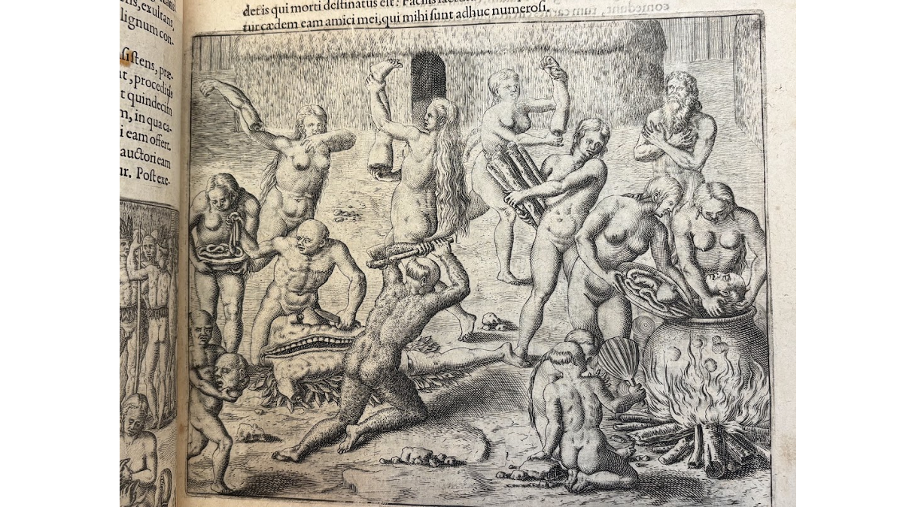{fig-alt="alt text to be filled" fig-align="center" width=100%}

::: {.notes}

:::

--- 

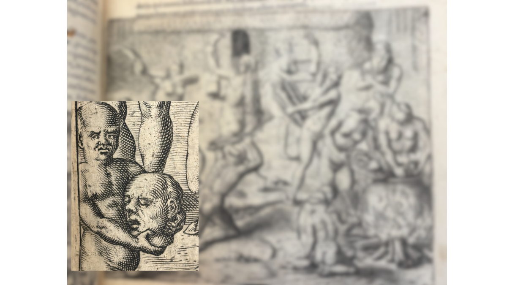{fig-alt="alt text to be filled" fig-align="center" width=100%}

::: {.notes}

:::

--- 

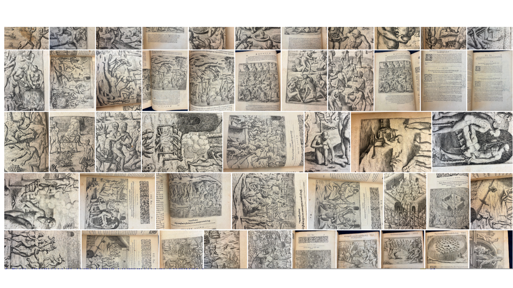{fig-alt="alt text to be filled" fig-align="center" width=100%}

::: {.notes}

IMPORTANT TO REMEMBER: De Bry never saw any of this in person. He necver crossed the atlantic to the Americas  Mostly relating tales from Mundus Novus (1503) by Amerio Vespucci

BUT THESE WERE THE IMAGES PEOPLE SAW. AND HE HAD A LOT OF THEM IN HIS BOOK (NEXT SLIDE)

Here's the thing though....at this point in history Europeans were ating per capita more human flesh and human remains than anyone else in the world.

:::

--- 

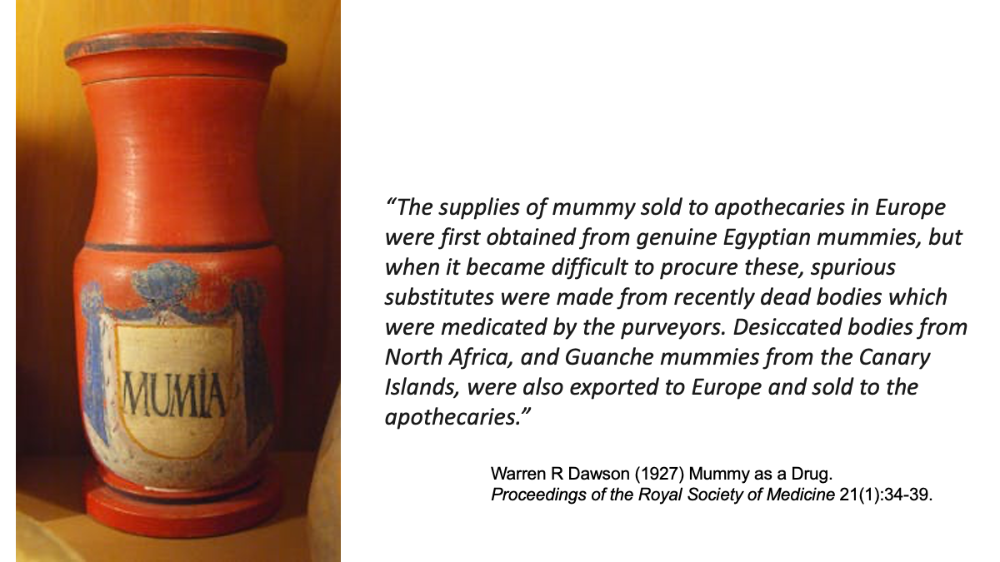{fig-alt="alt text to be filled" fig-align="center" width=100%}

::: {.notes}

From the 16th century on, an unusual form of medical cannibalism became widespread in several European countries, for which thousands of Egyptian mummies were ground up and sold as medicine. Powdered human mummies – called mummia – were thought to stop internal bleeding and have other healing properties. The practice developed into a widespread business that flourished until the early 18th century. The demand was much higher than the supply of ancient mummies, leading to much of the offered "mummia" being counterfeit, made from recent Egyptian or European corpses – often from the gallows – instead. In a few cases, mummia was still offered in medical catalogues in the early 20th century.

In medieval European medicine, mūmiyā "bitumen" was transliterated into Latin as mumia meaning both "a bituminous medicine from Persia" and "mummy". Merchants in apothecaries dispensed expensive mummia bitumen, which was thought to be an effective cure-all for many ailments. It was also used as an aphrodisiac.

It led to a huge black market for human bodies, whiuch resulted in digging up bodies from local graves  to make fake mummies.

This continued all the way thorugh the Victorian era!!

https://pmc.ncbi.nlm.nih.gov/articles/PMC2101801/

:::

--- 

# Bigger Picture #1:  

# Faith

::: {.notes}

:::

--- 

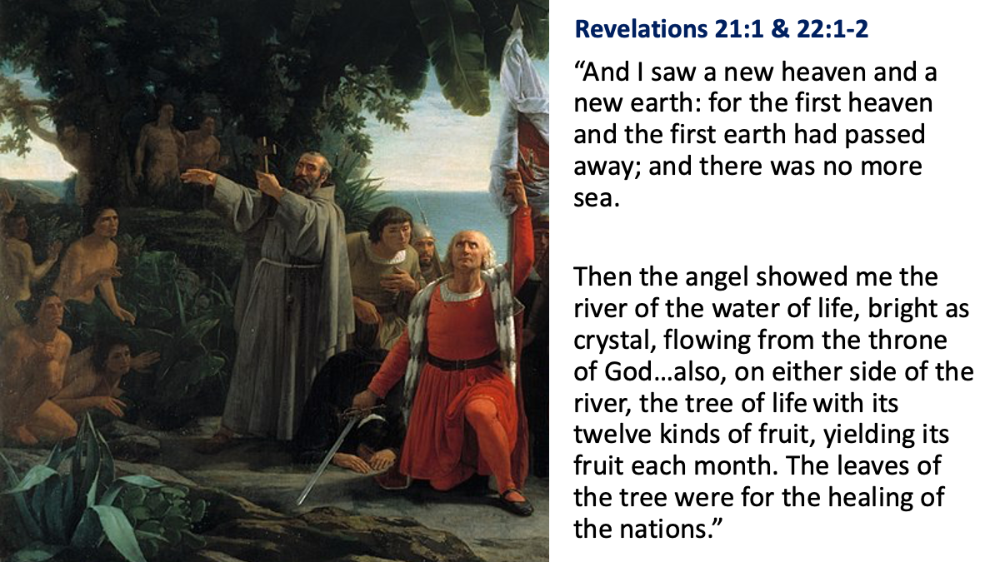{fig-alt="alt text to be filled" fig-align="center" width=100%}

::: {.notes}

:::

--- 

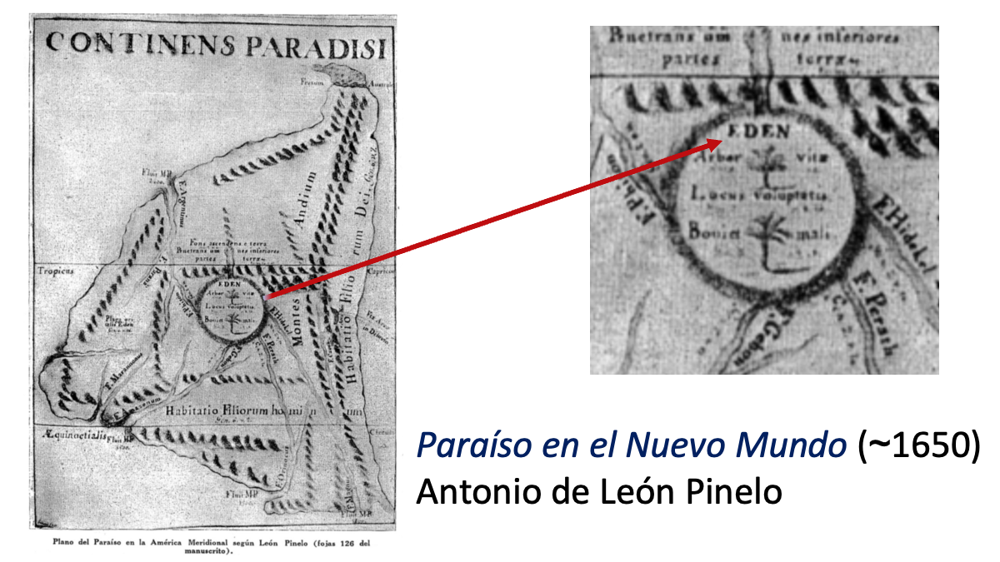{fig-alt="alt text to be filled" fig-align="center" width=100%}

::: {.notes}

:::

--- 

## And that's why...

::: {.notes}

:::

--- 

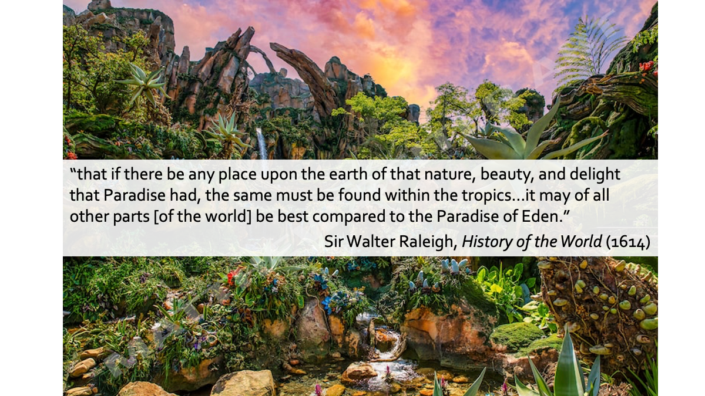{fig-alt="alt text to be filled" fig-align="center" width=100%}

::: {.notes}

:::

--- 

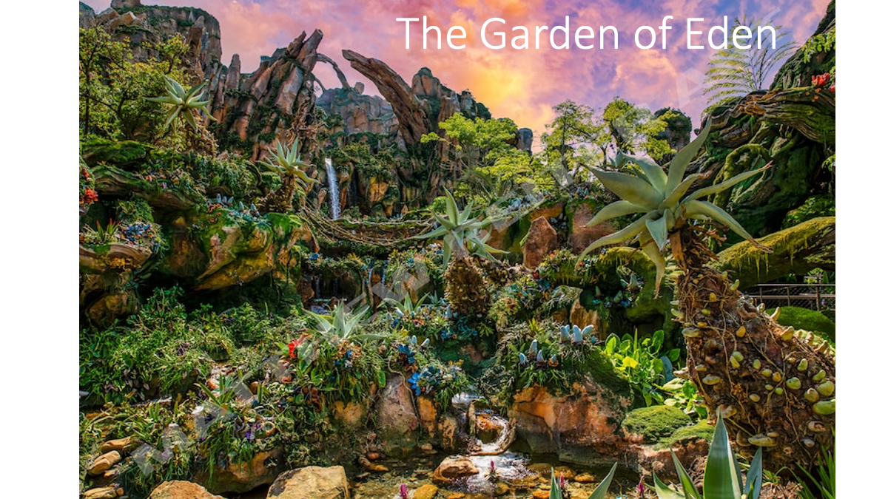{fig-alt="alt text to be filled" fig-align="center" width=100%}

::: {.notes}

:::

--- 

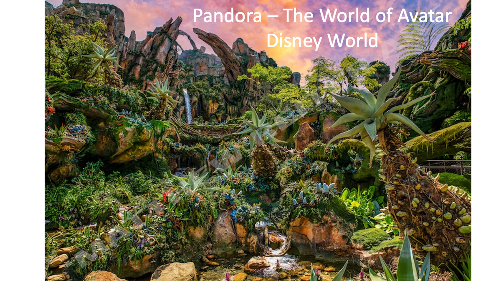{fig-alt="alt text to be filled" fig-align="center" width=100%}

::: {.notes}

:::

--- 

### Looks just like...

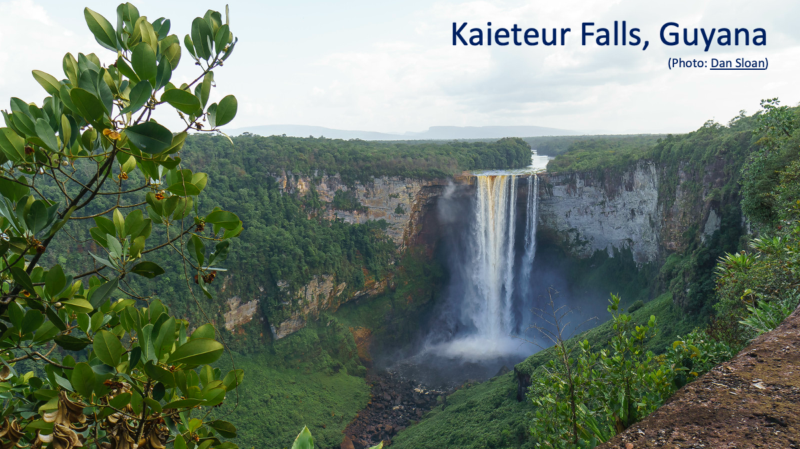{fig-alt="alt text to be filled" fig-align="center" width=100%}

::: {.notes}

:::

--- 

## And also...

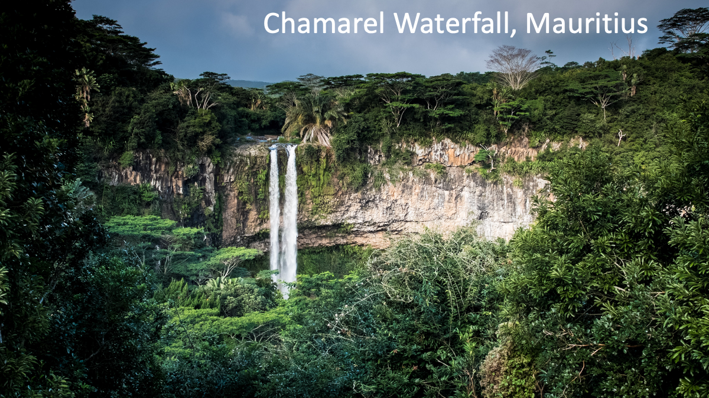{fig-alt="alt text to be filled" fig-align="center" width=100%}

::: {.notes}

:::

--- 

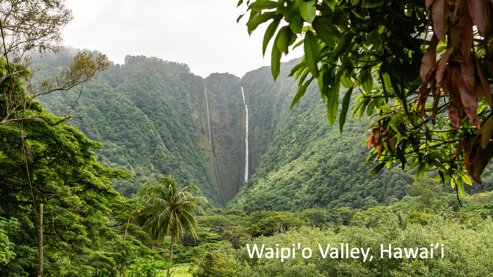{fig-alt="alt text to be filled" fig-align="center" width=100%}

::: {.notes}

:::

--- 

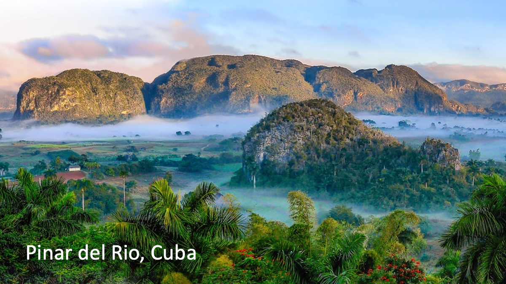{fig-alt="alt text to be filled" fig-align="center" width=100%}

::: {.notes}

:::

--- 

# Bigger Picture #2: 

# Money & Power

::: {.notes}

This raft made of gold was found in Pasca, Cundinamarca, in 1969, and is associated with the legend of El Dorado, representing the ceremony that used to take place in Lake Guatavita where the zipa would cover his body in gold dust and drop gold and emerald offerings into the lake.

:::

--- 

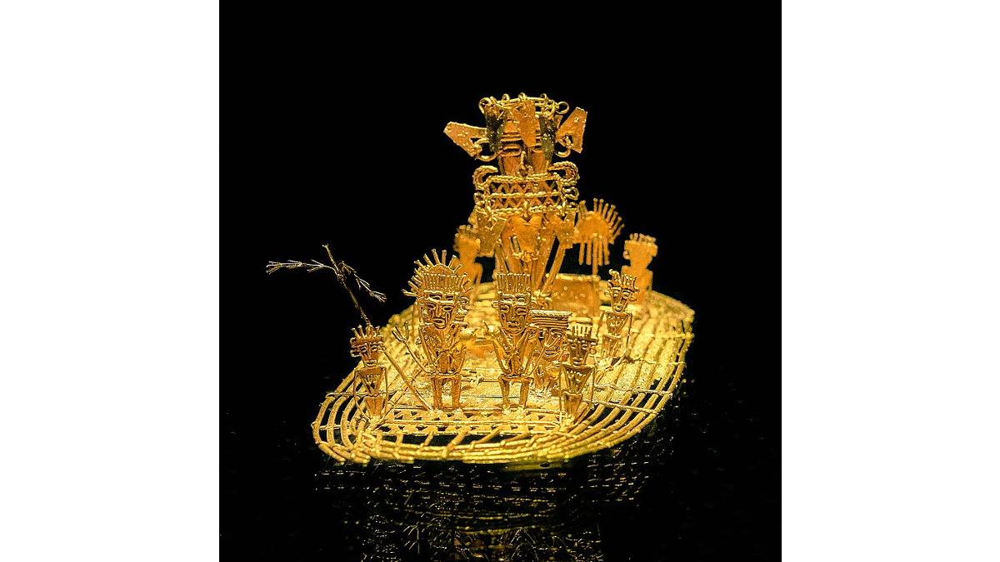{fig-alt="alt text to be filled" fig-align="center" width=100%}

::: {.notes}

:::

--- 

# Bigger Picture #3: 

# Culture (Clash)

::: {.notes}

:::

--- 

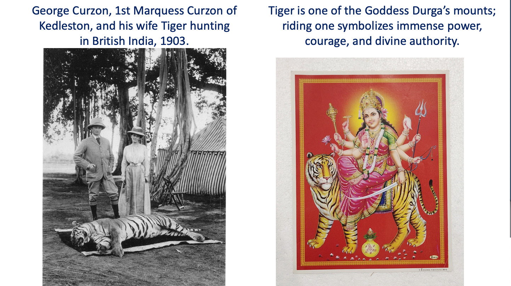{fig-alt="alt text to be filled" fig-align="center" width=100%}

::: {.notes}

As the Vehicle of Durga: The tiger features in the myths and legends of different cultures throughout India – the best known of which is probably as one of Durga’s vahan (vehicle). Goddess Durga is the principal Hindu warrior goddess who embodies supreme divine feminine energy (Shakti

vahan (mont)

The Viceroy and Vicereine: George Nathaniel Curzon served as the Viceroy of India from 1899 to 1905. His wife, Mary Curzon (an American heiress), held the highest official title available to a woman in the Indian Empire.

Big Game Hunting: Tiger hunting (shikar) was a common display of status, power, and masculinity among British imperial administrators and the English upper class during the Raj.

Ecological Impact: These organized hunts by colonial elites, alongside massive habitat alterations like clearing native forests for timber plantations, severely depleted South Asian wildlife populations over the decades
:::

--- 

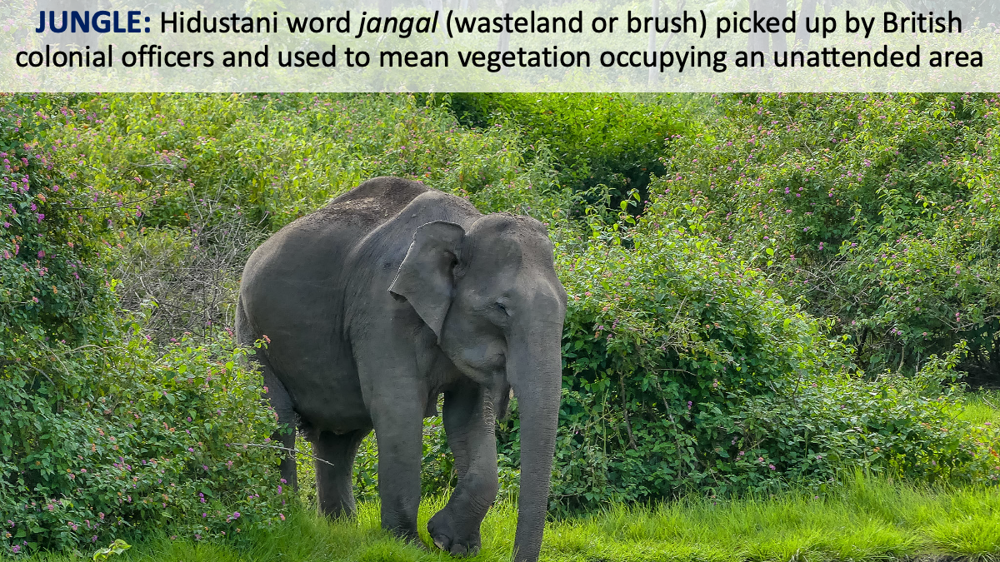{fig-alt="alt text to be filled" fig-align="center" width=100%}

::: {.notes}

:::

--- 

{fig-alt="alt text to be filled" fig-align="center" width=100%}

::: {.notes}

:::

--- 

