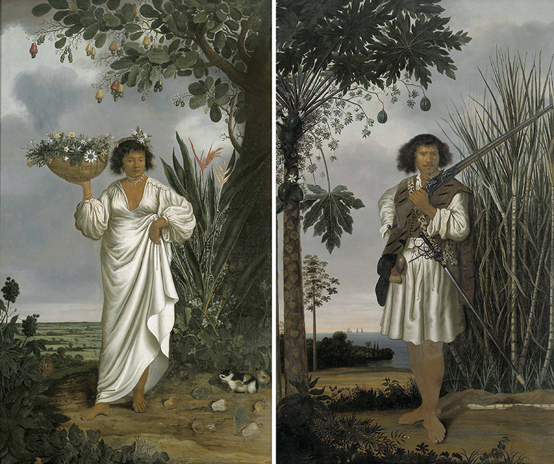
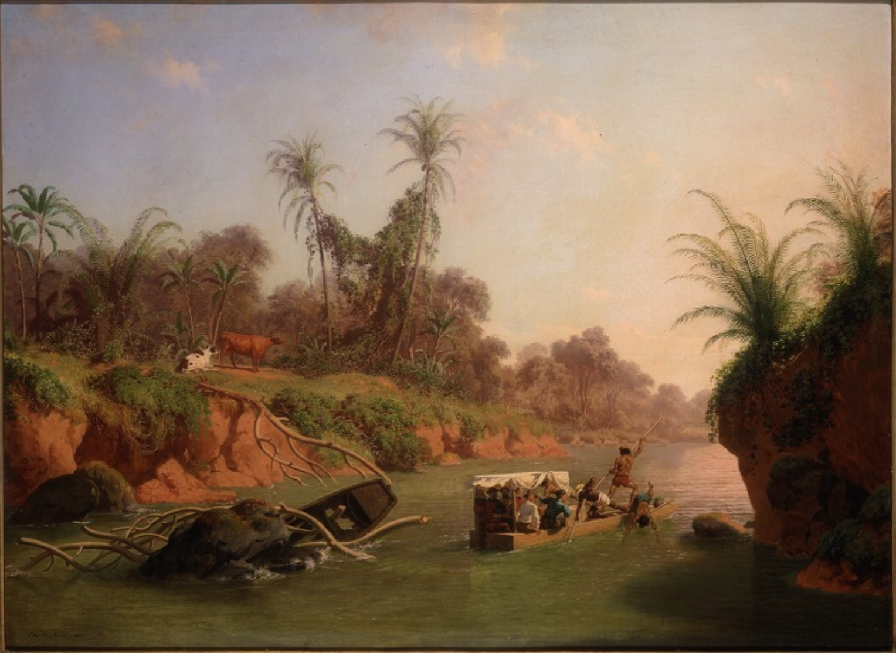
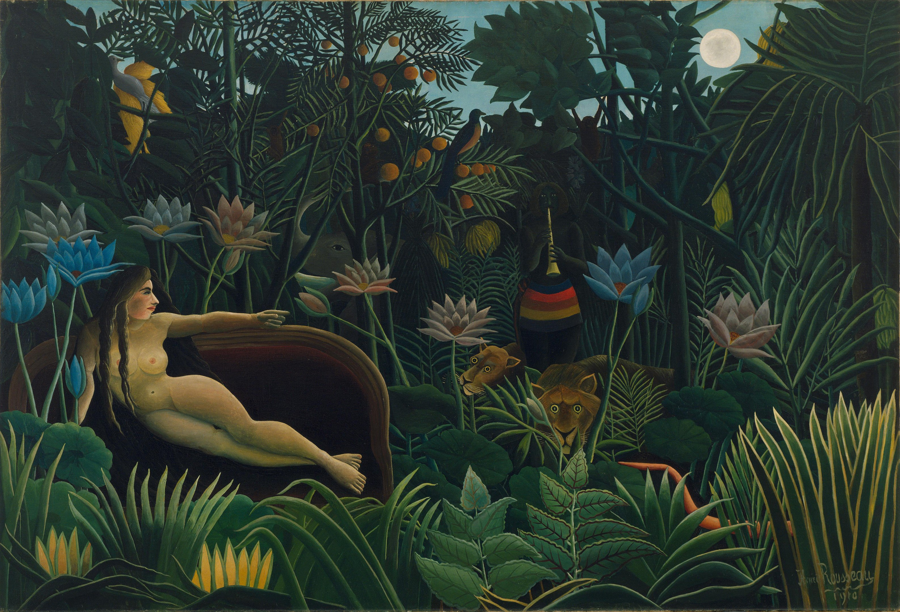
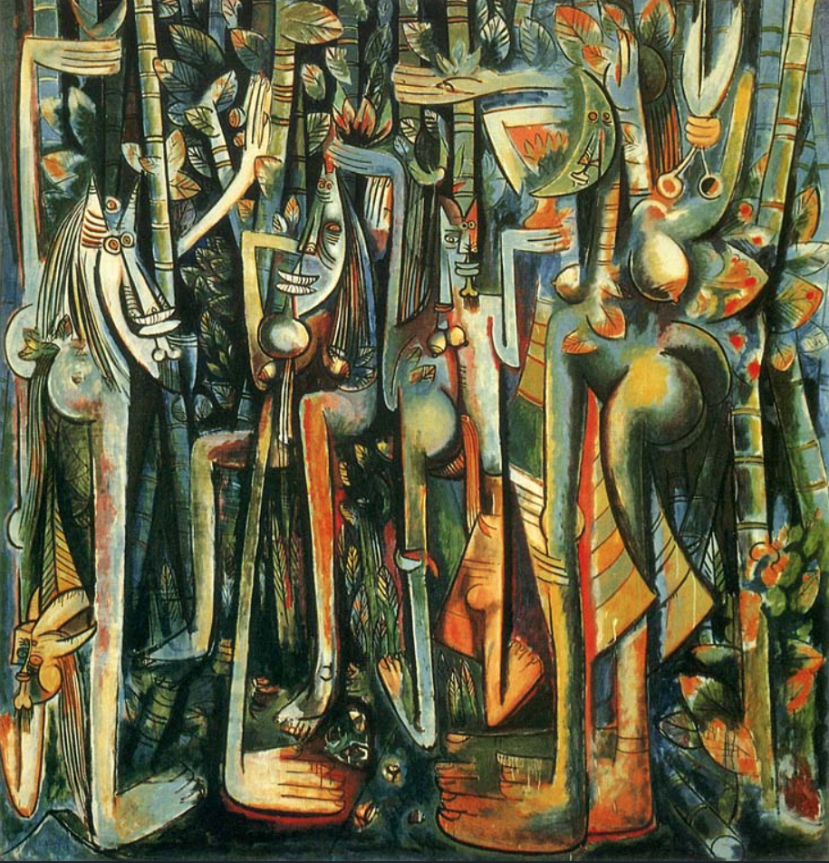

<!-- UPDATES TO MAKE: Add links to the public repositories of these texts on google books, etc. so people can find the original texts and images -->


```{r setup, include=FALSE}
knitr::opts_chunk$set(echo = TRUE)
```
# Image 1  
{height=70%}  
\newpage

# Image 2  
{height=70%}  
\newpage

# Image 3  
{height=70%}  

\newpage
# Image 4  
{height=70%}  


