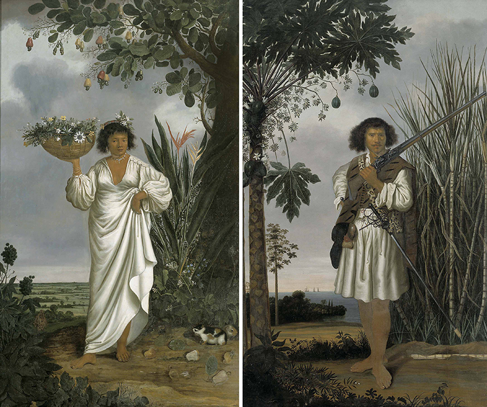
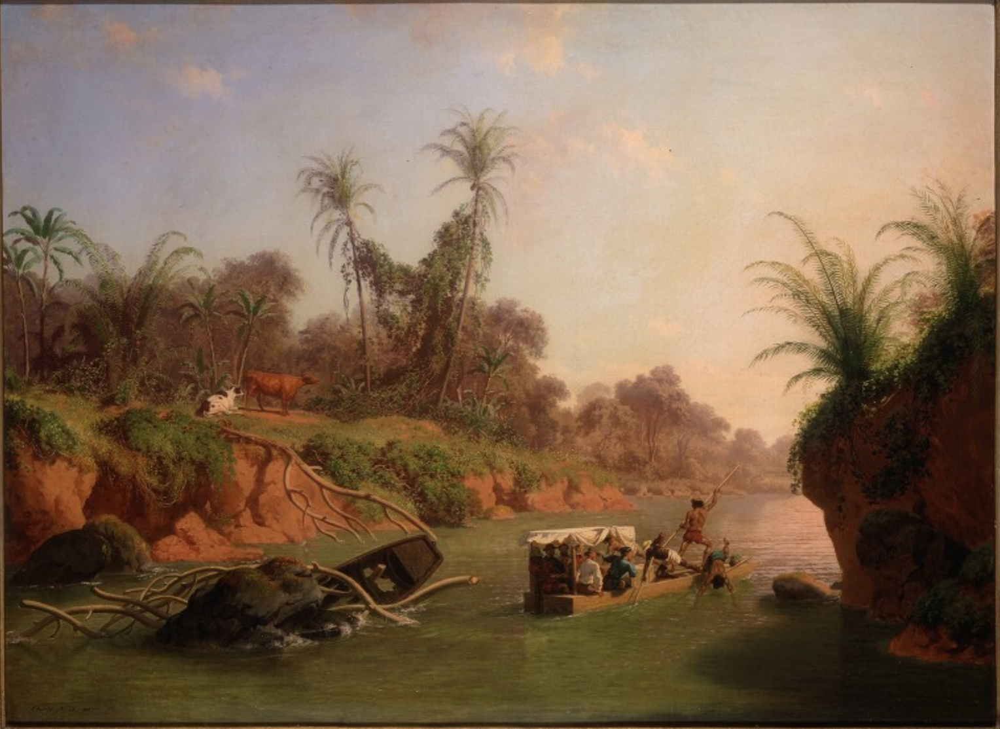
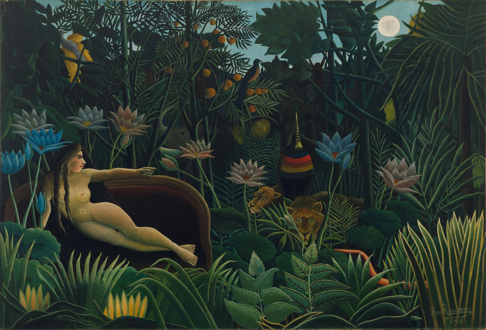

## Images of the Tropics

## Image 1  

{fig-alt="alt text to be filled" fig-align="center" width=100%}

\newpage

## Image 2  

{fig-alt="alt text to be filled" fig-align="center" width=100%}

\newpage

## Image 3  

{fig-alt="alt text to be filled" fig-align="center" width=100%}

\newpage

## Image 4  

{fig-alt="alt text to be filled" fig-align="center" width=100%}
