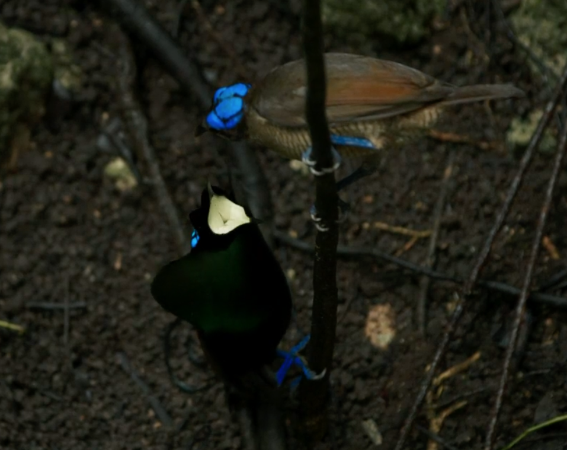

```{r setup, include=FALSE}
knitr::opts_chunk$set(echo = TRUE)
```

## Part 1: _What_ are rain forests?

The next section will dive into two big questions: *What* are rain forests and *Where* are rain forests.

<!-- It took the entire 1 hour session to watch the videos and respond to the questions. It will go faster if they watch the videos in advance next time, but this entire day should be devoted to "what is a rain forest" (structure, precipitation, etc.) -->

**Temperate Forest:** Watch the following 360$^\circ$  video of a Longleaf Pine Forest at the Jones Ecological Research Center (the Jones Center is located approx. 200 miles from UF in southern Georgia). Be sure to rotate the video and look all around, including at the treetops (i.e., the ‘canopy’) and down at the forest floor. Note: Turn off the volume

* [Longleaf Pine Forest](https://www.youtube.com/watch?v=kRD1CpQOF7Q) 

Now do the same thing with the following:

At least the first 3:50 of this 360$^\circ$ video from the Northeastern Amazon. **_Note: Turn off the volume_**

* [Amazon Forest](https://www.youtube.com/watch?v=5JvJCvdqvYs)
    
<!-- sana daily climatiology pecip: https://svs.gsfc.nasa.gov/4759 -->

Then these three videos taken at different heights of the rain forest

* [Video 1](https://youtu.be/jpUtVi9g004)  

* [Video 2](https://youtu.be/eS1RQVe1tPg)   

* [Video 3](https://youtu.be/za6Cn2i2wQI)  


## Discussion and Submission

With your group, discuss the following questions and submit your conclusions via this Canvas. 

**_Note:_** _Each answer to Q 1-6 should include observations from each forest type. For example, "The trees in temperate forest are ____ than the trees in the tropical forest."_


1. What do you observe about the relative height of trees in the tropical and temperate forest? 

1. What do you observe about the relative diameter of trees in the tropical and temperate forest? 

1. How does the structure of the forest canopy differ between the tropical and temperate forest? 

1. How do the Tropical and Temperate forest differ in their structure ( = complexity) as you move from the canopy to the forest floor?

1. What different categories of plants do you see in the temperate and tropical forest? (You don't have to know the technical terms - describe them. Or better still, ask the instructors the terms are for what you are describing)

1. Fill in the blanks: "Plants need three basic things to survive: _____, ______ , and ______". 

1. **(A)** What is happening in this picture, and **(B)** Based on your observations from the videos, why is it unlikely to work in the TEMPERATE forest?

1. What is happening in the picture below?

1. The picture was taken in a rain forest in Papua New Guinea. Based on your observations from the videos, why is what you are seeing in the picture unlikely to be effective in the TEMPERATE forest?

{#id .class width=50%}


