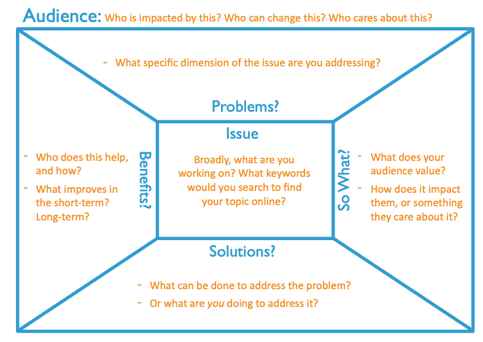
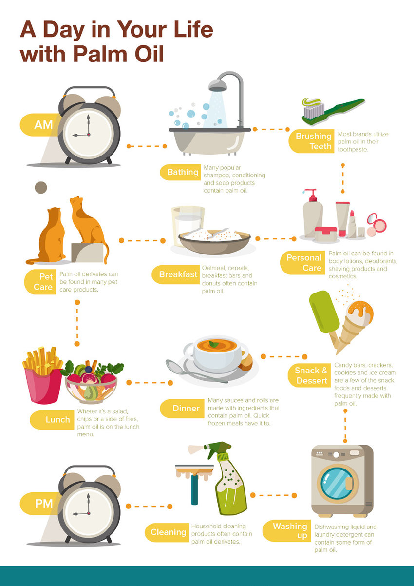
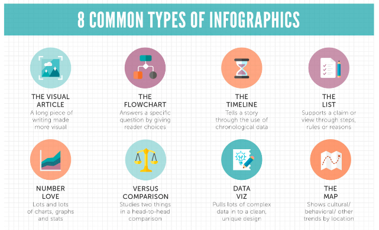

```{r setup_final_project, include=FALSE}
knitr::opts_chunk$set(echo = TRUE)
library(tidyverse)
library(kableExtra)
library(tidyverse)
```
<!-- https://www.homeworksmontana.com/wp-content/uploads/edd/2020/07/com_620_final_project_one_guidelines_and_rubric-1.pdf -->
<!-- https://www.cultofpedagogy.com/campaign-project/ -->

# WIS 2323: Final project
# Communicating about Rain Forests & Their Conservation
\vspace{0.3cm}

<!-- Instead of using traditional tests to assess your understanding of the material, we will be using what [Prof. Dan Baldassarre (SUNY Oswego)](https://twitter.com/evornithology/status/1453880536880095233/photo/1) calls #NotTest assignments. -->

## **PROJECT OVERVIEW:**   
Conservation organizations, museums, zoos, governments, and universities regularly undertake marketing initiatives to promote their conservation objectives, increase public awareness and concern for biodiversity, and encourage their audiences to adopt sustainable practices and lifestyles. These campaigns often rely on visual, audio, or social media to clarify and communicate their message, but [they are unlikely to be successful unless they have a narrow target audience, compelling campaign materials designed specifically for this audience, and they include a call to action](https://ssir.org/articles/entry/stop_raising_awareness_already). **Your assignment is to develop materials for a campaign that communicates to UF undergraduates (1) the importance of rain forests in their daily lives, and (2) concrete steps they can take to promote rain forest conservation.**

<!-- Increasing awareness about issues for which there is the first step towards mobilizing social change. We will put aside whether or not there is indeed an "information deficit"    -->

<!-- So the awareness campaigns also need to point towards specific actions people can take to actually advance rain forest conservation. https://ssir.org/articles/entry/stop_raising_awareness_already# -->

  * **Value: **200 Points
  * **Due: **14 December 2023
  * **Submission:** Via Canvas
  
**The Complete Assignment requires submission of the following three sections:**

1. Part 1: A complete _'Message Box'_ with audience-specific responses to the guiding questions (40 pts)
2. Part 2: A _Message Communication Tool_ designed specifically for your target audience (120 pts)
3. Part 3: A brief _reflection_ on the process and product (40 pts)


## **PART 1: The Message Box**   
There are many ways to effectively organize the scientific information we want to communicate to non-scientists. One of these is the 'Message Box' (Figure 1), which was developed by the organization [COMPASS](https://www.compassscicomm.org/) to help sort and distill information about a topic in a way that resonates _with your target audience_. The Message Box is often used by scientists talking about their own research when communicating with decision makers; you will be using it to map out how to communicate about complex issues related to rain forests and their conservation to your target audience.

1. Review the [Message Box Workbook](https://www.compassscicomm.org/wp-content/uploads/2020/05/The-Message-Box-Workbook.pdf); it includes blank templates you can use to construct your message box prior to the interview. 

<center>  

{width=70%} 

</center>


2. Fill out the 5 sections of the Message Box; note that the Sections 1-3 are already addressed by the assignment prompt 

    * **_Audience:_** Undergraduate students at UF
    * **_Issue:_** Identify and describe the overarching issue or topic that you are addressing. This should be in very broad terms - the big picture - and formulated as a short, concise, and clear phrase. For this assignment it is "Conserving Tropical Rain Forests"**
    * **_Problems?_** What are the specific topic(s) or conservation issue(s) that you are addressing? This can be 1-3 more detailed statments. For example, for this assignment the Problem(s) could be "1. College students are often unaware of how important rain forests are to their daily lives", and "2. College students have limited knowledge of immediate or simple actions they can take to promote rain forest conservation"
    * **_So What?_** Why should your audience care about the issue? (2-4 reasons)
    * **_Solutions?_** Outline the options for solving the problem or addressing the consequences of the issue you are discussing. Can your audience do anything to help? Remind yourself of why you are communicating this issue/problem to this audience.
    * **_Benefits?_** What good things will result from implementing the solution(s)? While it is important to address 'Global' benefits, *be sure to emphasize the local and direct benefits to your specific audience in ways that will resonate to them.*

## **PART 2: Communicating your message**  
The Message Box was originally developed as a tool for scientists that were going to be meeting with policy makers or being interviewed by the news media, and it has proven to be a very effective means of identifying and simplifying the information one is seeking to convey. **The next step is to communicate that message in a way that is relevant to your audience by creating materials to communicate your message**. To do so choose one of the three categories of materials below, but remember: **no matter which category you choose, your campaign materials _must_ include a call to action and concrete steps students can take** to promote rain forest conservation. 


1. **Option 1:** Prepare platform-specific social media materials that communicate the information in your Message Box. A [recent survey](https://www.ap.org/ap-in-the-news/2015/survey-young-adults-do-consume-news-in-their-own-way) found that very few university students (< 20%) actively seek out news from traditional news sources such as CNN or the New York Times. Instead, most university students (~60%) said they got their news by bumping into it on social media platforms. This is part of a broader trend in the US, in which [U.S. adults under 30 now trust information from social media almost as much as from national news outlets](https://www.pewresearch.org/fact-tank/2022/10/27/u-s-adults-under-30-now-trust-information-from-social-media-almost-as-much-as-from-national-news-outlets/). So release your inner-influencer! For example you could:  
    
    * Record TikTok videos (30-60 seconds) in different styles (explainer, street interview, day-in-the-life of a rain forest animal, whatever)^1^.
    <!-- * Make fake dating site profiles for tropical plants seeking animals to pollinate or disperse them [you can make fake ones and doanload the images with [this site](https://tinderkit.com/)] to share on Twitter. Be sure to include information about the biology, ecological importance, and threats faced by these species. -->
    <!-- * Prepare a "(*Celebrity*) as __________" twitter thread (e.g., [Example 1](https://twitter.com/JohnRossMD/status/1436542407278006273), [Example 2](https://twitter.com/autumnsonatah/status/1116323477844316161?s=20), [Example 3](https://twitter.com/adorvtete/status/1116070915656355842?s=20)) with a group of endangered, unusual, charismatic, or weird rain forest plant or animal species as the _________. Include biological information about the species and their conservation status, photo credits, and links to research / conservation efforts. etc. -->
    * Record a series of Instagram Stories or animated YouTube video.

    You are not required to post your videos, nor do you have to appear in them (though you may if you wish to). Regardless  of your communication format, be sure to use photos, music, or video that are in the public domain or that have been licensed under the creative commons. ([Unsplash](https://unsplash.com/) is a great source of photos you can use for free with no attribution required).  

    ^1^ If you choose this option, you might find this [post on TikTok trends](https://invideo.io/blog/tiktok-trends/) useful...though let's be honest, how cool can something be if there is an article telling you how cool it is? There are also free [templates](https://www.canva.com/create/tiktok-videos/) you can use to help you prepare your videos.  
  


<!-- #### **Option 3: Palm Oil Survey**  -->

<!-- We can also communicate on much smaller scales and have local impacts. Option 3 is to survey your home^1^ for all products that contain palm oil or its derivatives.  -->

<!-- ##### Instructions -->
<!-- 1. Survey your home for products that contain palm oil or palm oil derivatives. Make a list recording the item and manufacturer.  -->
<!-- 2. Take a picture of you with all the products you find (e.g., piled on the table) -->
<!-- 3. For each item, find an alternative that either doesn't contain palm oil or contains palm oil certified by the [Roundtable on Sustainable Palm Oil](https://rspo.org/about). -->
<!-- 4. Use the Message Box to craft a message about Palm Oil, its social and ecological impact for tropical rain forests, and alternatives that UF students could use to avoid its consequences. -->
<!-- 5. Write a letter to the Editor of the Gainesville Sun or Independent Alligator based on your Message Box.  -->

<!-- ^1^If you live with a larger group (e.g., co-op or greek housing) recruit some house-mates to help. If you live in a dorm, you can review the list of cleaning products used by UF Facilities and the items being sold in the POD market (note that you can't take pictures of the items in POD). Write and submit a letter to the Editor for the Sun or Alligator in which you argue for alternatives that promote rain forest conservation in light of what you find.    -->

<!-- ##### Rubric -->


2. **Option 2: Make a Poster**: Alternatively, you could prepare an poster for to explain to your focal audience the issue in your Message Box.  

    A visually captivating poster can be a great way to communicate information.  You should make a poster than can be printed 11' x 17', but other than that the content and desgin is up to you - for instance it could be an infographic poster (see below), or you could make it in the style of a poster for a movie or concert. Just remember your target audience - would it capture _your_ attention? Would _you_ hang it on the wall of your apartment? - and that it must include a call to action and concrete steps. 
    
    **Posters:** Some inspirational examples of conservation campaign posters can be found here:  
    - https://www.pinterest.com/pin/107312403594437707/
    - https://za.pinterest.com/jax1703/conservation-campaigns/ 
    - https://www.printrunner.com/blog/earth-day-poster-ideas/
    
    
    **Infographics:** Many campaigns use an infographic poster to convey their message. What is an Infographic? It is a “visual representation of information or data”. Put another way, it is an easy-to-understand overview of a topic using a collection of images, data visualizations (e.g., bar graphs, symbols of different sizes), and minimal text. Infographics make information easy to understand and are visually appealing.  I really like the one on how prevalent palm oil is in our daily lives (Figure 2). 
    
    To get started, here is an overview on [Different Types of infographics and how to make them](https://www.clips.edu.au/infographics/) (see also Figure 3). This site includes links to sites where you can make them for free with templates, but the easiest thing might be to make it with PowerPoint. [This short video](https://www.youtube.com/watch?v=66fnRMbYXsE) will walk you through how to find and import graphics into PowerPoint; step-by-step directions on making an infographic in powerpoint can be found [here](https://graphicmama.com/blog/how-to-make-an-infographic-in-powerpoint/). Just remember: an infographic should be _focused_ (one single message; emphasize its significance to you), _graphic_ (graphics and images tell the story, fewer than 800 words), and _ordered_ (the sequence should be obvious; simple flow paths and cues should guide the reader).  
      
      **IMPORTANT NOTE: **There are _lots_ of templates online for both infographics and environmental campaign posters. However, these tend to be very generic - remember that your poster must be relevant to UF students. **_I'd rather see something lkess polished but relevant than a generic poster / infographic that  doesn't engage or is irrelevant your audience._**
      
<!-- There are many common types of infographics (see also  [ex. 1](https://piktochart.com/blog/layout-cheat-sheet-making-the-best-out-of-visual-arrangement/), [ex. 2](https://alltimedesign.com/infographics/the-ultimate-infographics-design-cheat-sheet/), [ex. 3](https://blog.hubspot.com/marketing/infographic-layout-cheat-sheet), [ex 3]. ), -->

<!-- Still need some inspiration or help? There are some really good cheat sheets that explain different infographic layouts ([ex. 1](https://piktochart.com/blog/layout-cheat-sheet-making-the-best-out-of-visual-arrangement/), [ex. 2](https://alltimedesign.com/infographics/the-ultimate-infographics-design-cheat-sheet/), [ex. 3](https://blog.hubspot.com/marketing/infographic-layout-cheat-sheet), [ex 3]. You can also find free templates at [Canva](https://www.canva.com/infographics/templates/), though this may be most useful to find ideas.  -->

<!-- Finally, a google search of 'Rain Forest Infographics' yielded a ton of [really cool ones that could inspire you](https://www.google.com/search?q=rainforest+infographic&rlz=1C5CHFA_enUS828US828&sxsrf=AOaemvKre-yKAA90GEm2I4uu2OCeUyGBqg:1638467860881&source=lnms&tbm=isch&sa=X&ved=2ahUKEwiH48q22MX0AhVZTTABHYF2ApwQ_AUoAXoECAEQAw&biw=2189&bih=1220&dpr=1), and there also some great Pinterest collections of rain forest infographics ([Ex 1](https://www.pinterest.com/alicat1972/rainforest-infographics/).  -->

<!-- <center> -->
<!-- {height=40%, width=40%}  -->
<!-- <\center>   -->

<!-- 1. Useful Bait: Works well with most of the data; Easy to read and good usability   -->
<!-- 2. Versus/ Comparison: Works well with a lot of information; Design(visual) is very important; Information has to be very interesting -->
<!-- 3. Heavy Data/Lots of Numbers: Works well with marketing strategy; Timeline for project; Can extend to a flowchart   -->
<!-- 3. Road Map: Good for storyline/journey; Can be used as a timeline too -->
<!-- Timeline: Can be a comparison; Good for timeline and journey too; From simple to complex (depends on your data)   -->
<!-- 4. Visualized Article: Needs strong title; Works well with heavy content; Easy to read and understand   -->

<!-- Credit: Infographic Layout Cheat Sheet by [SeeMei Chow](https://piktochart.com/blog/layout-cheat-sheet-making-the-best-out-of-visual-arrangement/) at Piktochart. -->
<!-- Assignment inspired by: https://www.e-education.psu.edu/egee299/node/485 -->


<!-- #### **OPTION 5: Run the En-Roads Simulation for a Group of Friends or your Family** -->

3. **Option 3: Propose your own 'Communication Materials'**

    Don't like either of the options above? No problem! Propose a different way to creatively communicate about rain forests and their conservation to your fellow UF students. Below are some possibilities I came up with after a morning consuming far too much RFA-certified coffee and chocolate; you're welcome to tackle one of them or propose something else.  **_If you do want to propose your own project, you need to discuss it with me first so we can define the expectations and a grading rubric. The deadline to do that is November 27nd, 2023._** 

    * **Music:** Write a song about your topic and record yourself (or a friend) performing it. Or maybe rewrite the lyrics of [these cheesy 1980's love songs](https://www.yourtango.com/2019320830/35-best-cheesy-love-songs-80s-and-90s-lyrics-so-bad-theyre-good) to be about rain forests and record those. Perform a concert for friends of a piece you composed. 
    * **Art:** create artwork (any medium: digital, ceramics, painting, woodcuts, comics, stickers)
    <!-- * [Make a twitter bot](https://botwiki.org/resource/tutorial/how-to-make-a-twitter-bot-the-definitive-guide/) that posts deforestation data (it may not be up long, but hey - it will be cool while it lasts). -->
    * **Website:** Make an website that presents information about rainforests in a creative way. We saw examples of powerful online data visualizations in the newspaper articles we read. Here is another way to do that: a [map showing the flow of resources](https://gisgeography.com/flow-maps/) from the tropics to UF 
    <!-- * Make five-minute Video Recaps of individual course sessions -->
    * **Podcast:** What you do is up to you. For example, you could record the first episode of a podcast series in which you interview rain forest plants or animals (inspired by [*Everything is Alive*](https://www.radiotopia.fm/podcasts/everything-is-alive)). Or maybe it's a true-crime podcast. Or movie reviews. Whatever you want. 
    * **Buzzfeed-style list:** Compile a list of Rain Forest Fails in Advertising, Marketing, or Popular Culture (with explanations of why they are incorrect).
    <!-- * Come up with new question's for next year's class *Jeopardy* -->
    * **Event:** organize an event for your rommates, sorority, fraternity, club, or team (trivia night, climate change scenario simulation with en-ROADS, fundraiser, movie night).
    * **Stream:** Do you game? Maybe stream you playing video games about rain forests where you critique the way they present the material: [try the free demo of _Empires of the Undergrowth_](https://store.steampowered.com/app/463530/Empires_of_the_Undergrowth/), If you want to play [_Green Hell_](https://store.steampowered.com/app/815370/Green_Hell/) I have a code for you to download it for free). 
    * **Memes**: Create memes to highlight your selected issues, with an emphasis on awareness of the local relevance of rain forests and actions students can take to advance their conservation.
    <!-- * Create Amazon product pages for things they use every day that are driving deforestation (you can find the template [here](https://ditchthattextbook.com/social-media-templates/) -->
    <!-- * Use the Netflix Series template to Imagine a documentary series about a UF student on a quest to learn about rain forests. Maybe the documentary follows them as they learn about how prevalent rain forests are in their daily life, about the diversity of rain forests (e.g., ecological, cultural), about the vital role of rain forests in the global climate cycle, and about the myriad threats to rain forests. Describe the documentary and each episode using this Netflix Series Template. Be sure to think about the final episodes - does the student give up and accept dystopian future without jungles, or do they decide to take bold individual and collective action to advance rain forest conservation? Or maybe a series about a dystopia future *without* rainforests...(you can see some examples of how others have used these templates [here](http://edtechpicks.org/2019/11/netflix-template/))/ -->
    * **Anything else:** No idea is too weird. 

<!-- https://www.techlearning.com/how-to/how-can-tiktok-be-used-in-the-classroom -->
<!-- * Digital annotation; mapping -->
<!-- * Zoom meeting of rain forest species strategizing to save their reserve -->
<!-- * Wikipedia entry -->
<!-- https://ditchthattextbook.com/social-media-templates/ -->
<!-- https://techwiser.com/fake-social-media-generators-web-mobile/amp/ -->
<!-- https://blog.tcea.org/simple-process-template-student-podcasting/ -->

<!-- -ask your representatives about issue X -->
<!-- write a PSA  -->
<!-- visualization of deforestation -->
<!-- make a movie trailer for the class -->
<!-- <!-- mock trend video --> 
<!-- https://citl.indiana.edu/teaching-resources/assessing-student-learning/alternatives-traditional-exams-papers/index.html -->
<!-- https://www.dal.ca/dept/university_secretariat/academic-integrity/faculty-resources/preventing/assignment-ideas.html -->
<!-- https://academictech.uchicago.edu/2019/05/07/creative-assignments-map-and-timeline-exercises/ -->
<!-- https://medium.com/campuswire/7-creative-assignments-for-your-virtual-classroom-e3c7b188fa67 -->
<!-- https://ctl.wustl.edu/resources/tools-for-creative-assignment-development/ -->

<!-- RUBRIC:  -->
<!-- http://sisltportfolio.missouri.edu/charlesj/documents/PodcastingRubric.pdf -->
<!-- https://www2.uwstout.edu/content/profdev/rubrics/podcastrubric.html -->
<!-- https://www.rcampus.com/rubricshowc.cfm?code=YXXA29W&sp=yes& -->
<!-- https://mirjamglessmer.com/2020/05/10/evaluation-rubric-for-instagram-posts-in-scicomm-and-or-science-classes/ -->
<!-- https://www.jou.ufl.edu/assets/syllabi/ADV6325-Section7059_706A_ADVERTISING%20AND%20SOCIAL%20MEDIA-Mueller-SummerC15.pdf -->
<!-- https://www.cmu.edu/teaching/assessment/assesslearning/creatingassignments.html  -->

<!-- <!-- https://theartofeducation.edu/2016/08/05/memorable-meme-project-beginning-year/ --> 


<!-- Provided a written description of the assignment (in the syllabus or in a separate document)? -->
<!-- Specified the purpose of the assignment? -->
<!-- Indicated the intended audience? -->
<!-- Articulated the instructions in precise and unambiguous language? -->
<!-- Provided information about the appropriate format and presentation (e.g., page length, typed, cover sheet, bibliography)?   -->
<!-- Indicated special instructions, such as a particular citation style or headings?   -->
<!-- Specified the due date and the consequences for missing it? -->
<!-- Articulated performance criteria clearly? -->
<!-- Indicated the assignment’s point value or percentage of the course grade? -->
<!-- Provided students (where appropriate) with models or samples? -->
<!-- https://www.actionteaching.org/award/practical-activism -->

<!-- https://iopscience.iop.org/article/10.1088/0963-6625/2/2/005/meta -->
<!-- https://www.sciencedirect.com/science/article/pii/S0169534708002152?casa_token=GQ12D6Llz4wAAAAA:waQL4pRRAwNXvZcV9NJZyTl7S71La68yIAjTOsOjoSN6ZW1ZCQEKrysYcXEYWgbUdSaOuQqRPAM -->

## **PART 3 (40 points):**  Reflection
<!-- https://uncw.edu/appliedlearning/documents/critical-reflection-prompts-and-examples.pdf -->
<!-- https://www.hilbert.edu/Public/file/service%20learning%20reflection%20questions%20what%20so%20what%20now%20what.pdf -->
Once you have completed the project, take time to reflect critically on the following and **_summarize your reflection in a 400-500 words essay_**.

1. What you learned from this project about the challenge of communicating about tropical rain forests to audiences that may not know much about them;
1. Any new skills, knowledge, or information you gained this semester (both things we covered in class and any you learned through your own activities and experiences);
1. What actions you might take going forward that will advance rain forest conservation


\newpage

# Rubrics:

## Part 1: Message Box (40 pts)

\vspace{0.3cm}
```{r assign, echo=FALSE,message = FALSE,warning=FALSE}

compass <- read_csv("./resources/rubric_compass.csv") %>% 
  kbl() %>%
  kable_styling(full_width = T,
                 latex_options="scale_down",
                 font_size = 8) %>% 
  column_spec(1,bold=T) %>% 
  row_spec(0,bold=T)
compass
# df2<- c("","","TOTAL",sum(assignments$Points))
# assignments <- rbind(assignments,df2)
# landscape()
# assignments[5, 3]<-cell_spec(assignments[6, 3], "latex",  align="c")
# kable(compass,
#       # digits = 2,
#       align="l",
#       format="latex",
#       row.names = FALSE,
#       escape= F,
#       booktabs=T,
#       linesep = "",
#       ) %>%
#    kable_classic_2(full_width = T,
#                 latex_options="scale_down",
#                 font_size = 8,
#                 position = "left") %>%
#   column_spec(1, width = "15em") %>%
#   column_spec(2, width = "13em") %>%
#   column_spec(3, width = "3em") %>%
#   column_spec(4, width = "3em") %>%
#   row_spec(0,hline_after = F, bold=T) %>%
#   row_spec(c(1:5),hline_after = T) %>%
#   row_spec(6,bold=T) %>%
#   add_indent(6)

```
\newpage

## Part 2: Communication Tool (120 pts)

**Option 1**
\vspace{0.3cm}
```{r social, echo=FALSE,message = FALSE,warning=FALSE}
social <- read_csv("./resources/rubric_social.csv") %>% 
  kbl() %>%
  kable_styling(full_width = T,
                 latex_options="scale_down",
                 font_size = 8) %>% 
  column_spec(1,bold=T) %>% 
  row_spec(0,bold=T)
social
# df2<- c("","","TOTAL",sum(assignments$Points))
# assignments <- rbind(assignments,df2)
# landscape()
# assignments[5, 3]<-cell_spec(assignments[6, 3], "latex",  align="c")
# kable(compass,
#       # digits = 2,
#       align="l",
#       format="latex",
#       row.names = FALSE,
#       escape= F,
#       booktabs=T,
#       linesep = "",
#       ) %>%
#    kable_classic_2(full_width = T,
#                 latex_options="scale_down",
#                 font_size = 8,
#                 position = "left") %>%
#   column_spec(1, width = "15em") %>%
#   column_spec(2, width = "13em") %>%
#   column_spec(3, width = "3em") %>%
#   column_spec(4, width = "3em") %>%
#   row_spec(0,hline_after = F, bold=T) %>%
#   row_spec(c(1:5),hline_after = T) %>%
#   row_spec(6,bold=T) %>%
#   add_indent(6)

```
\newpage
**Option 2**
\vspace{0.3cm}
```{r info, echo=FALSE,message = FALSE,warning=FALSE}
info <- read_csv("./resources/rubric_info.csv") %>% 
  kbl() %>%
  kable_styling(full_width = T,
                 latex_options="scale_down",
                 font_size = 8) %>% 
  column_spec(1,bold=T) %>% 
  row_spec(0,bold=T)
info
# df2<- c("","","TOTAL",sum(assignments$Points))
# assignments <- rbind(assignments,df2)
# landscape()
# assignments[5, 3]<-cell_spec(assignments[6, 3], "latex",  align="c")
# kable(compass,
#       # digits = 2,
#       align="l",
#       format="latex",
#       row.names = FALSE,
#       escape= F,
#       booktabs=T,
#       linesep = "",
#       ) %>%
#    kable_classic_2(full_width = T,
#                 latex_options="scale_down",
#                 font_size = 8,
#                 position = "left") %>%
#   column_spec(1, width = "15em") %>%
#   column_spec(2, width = "13em") %>%
#   column_spec(3, width = "3em") %>%
#   column_spec(4, width = "3em") %>%
#   row_spec(0,hline_after = F, bold=T) %>%
#   row_spec(c(1:5),hline_after = T) %>%
#   row_spec(6,bold=T) %>%
#   add_indent(6)

```

\newpage
## Part 3: Reflection (40 pts)
<!-- https://brocku.ca/pedagogical-innovation/wp-content/uploads/sites/53/Critical-Reflection-Rubric.pdf -->
\vspace{0.3cm}
```{r reflection, echo=FALSE,message = FALSE,warning=FALSE}
info <- read_csv("./resources/rubric_reflection.csv") %>% 
  kbl() %>%
  kable_styling(full_width = T,
                 latex_options="scale_down",
                 font_size = 8) %>% 
  column_spec(1,bold=T) 
info
# df2<- c("","","TOTAL",sum(assignments$Points))
# assignments <- rbind(assignments,df2)
# landscape()
# assignments[5, 3]<-cell_spec(assignments[6, 3], "latex",  align="c")
# kable(compass,
#       # digits = 2,
#       align="l",
#       format="latex",
#       row.names = FALSE,
#       escape= F,
#       booktabs=T,
#       linesep = "",
#       ) %>%
#    kable_classic_2(full_width = T,
#                 latex_options="scale_down",
#                 font_size = 8,
#                 position = "left") %>%
#   column_spec(1, width = "15em") %>%
#   column_spec(2, width = "13em") %>%
#   column_spec(3, width = "3em") %>%
#   column_spec(4, width = "3em") %>%
#   row_spec(0,hline_after = F, bold=T) %>%
#   row_spec(c(1:5),hline_after = T) %>%
#   row_spec(6,bold=T) %>%
#   add_indent(6)

```

\newpage

# Sample Infographics

<center>  
{width=70%}  
</center>  
      
 
<center>
<!-- {height=60%, width=80%}  -->
{width=60%} 

</center>
